# Lire les graphes Mermaid

Ce guide est fait pour lire une doc Mermaid sans se melanger entre flux, appels et dependances.

Le point cle : une fleche se lit toujours de sa source vers sa cible.

## Regle de base

Dans un `flowchart`, lis toujours une fleche comme une phrase :

- `A --> B` = `A` va vers `B`
- si le schema parle d'appels : `A` appelle `B`
- si le schema parle de dependances : `A` depend de `B`
- si le schema parle de flux : quelque chose part de `A` et arrive dans `B`

Autrement dit :

- les fleches sortantes d'un noeud montrent ce qu'il utilise, appelle ou alimente
- les fleches entrantes montrent qui utilise ce noeud, ou qui lui envoie quelque chose

Mini pense-bete :

- `A --> B` = `A` vers `B`
- `A <-- B` = `B` vers `A`
- `A <--> B` = relation dans les deux sens, a lire comme deux fleches distinctes
- `A -.-> B` = lien plus faible, indirect ou optionnel selon la doc

## 1. Relation la plus simple

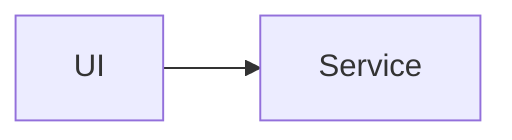

Lecture :

1. On part de `UI`.
2. On suit la pointe de la fleche.
3. On arrive sur `Service`.

Donc :

- en mode "appel" : `UI` appelle `Service`
- en mode "dependance" : `UI` depend de `Service`
- `Service` ne depend pas de `UI` dans ce schema

Regle pratique : si tu te perds, lis la fleche a voix haute comme une phrase courte.

## 2. Une chaine simple

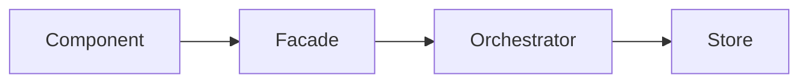

Lecture :

1. `Component` utilise `Facade`
2. `Facade` utilise `Orchestrator`
3. `Orchestrator` utilise `Store`

Pour trouver les dependances de `Facade` :

- regarde ses fleches sortantes
- ici, `Facade` depend de `Orchestrator`

Pour trouver qui depend de `Facade` :

- regarde ses fleches entrantes
- ici, `Component` depend de `Facade`

## 3. Plusieurs dependances sortantes

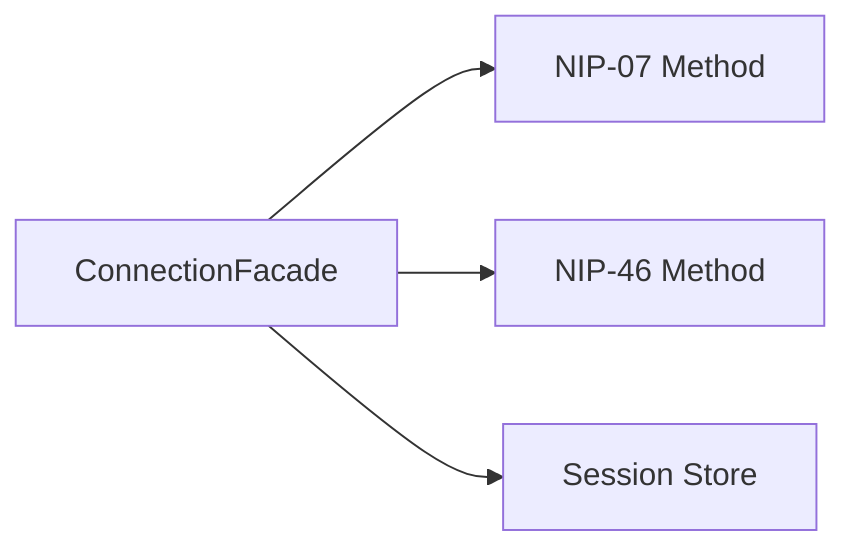

Lecture :

- `Facade` connait plusieurs cibles
- donc `Facade` peut utiliser plusieurs briques
- les trois fleches sortent de `Facade`, donc les dependances partent de `Facade`

Quand un noeud a plusieurs sorties, pose-toi cette question :

`De quoi ce noeud a-t-il besoin pour faire son travail ?`

La reponse est souvent : ses cibles.

## 4. Plusieurs entrees vers la meme cible

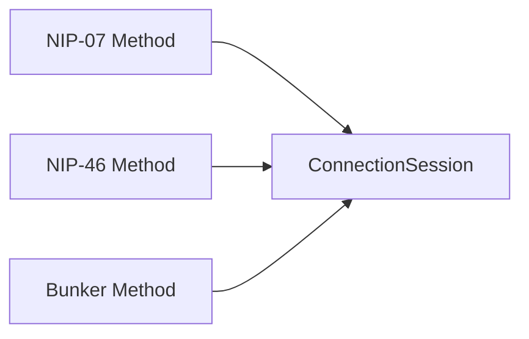

Lecture :

- plusieurs sources pointent vers `ConnectionSession`
- cela veut dire que plusieurs chemins produisent ou alimentent la meme chose

Question utile :

`Qui peut impacter ConnectionSession ?`

Reponse dans ce schema :

- `NIP-07 Method`
- `NIP-46 Method`
- `Bunker Method`

Pourquoi ? Parce que ce sont les noeuds avec des fleches entrantes vers `ConnectionSession`.

## 5. Une boucle ne veut pas dire "tout depend de tout"

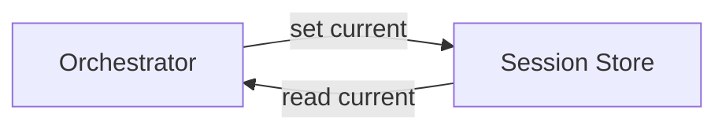

Lis chaque fleche separement :

- `Orchestrator --> Store` : l'orchestrateur ecrit dans le store
- `Store --> Orchestrator` : l'orchestrateur relit un etat via le store

Important :

- deux fleches opposees ne veulent pas dire automatiquement "dependance circulaire"
- elles peuvent juste decrire deux actions differentes
- les labels sur les fleches aident beaucoup a lever l'ambiguite

## 6. Orientation du graphe

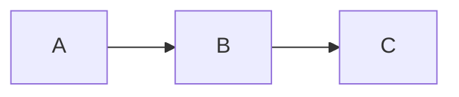

`LR` veut dire `Left to Right`.

On lit donc naturellement de gauche a droite.

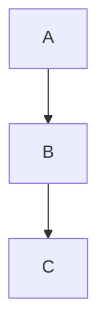

`TD` veut dire `Top Down`.

On lit donc de haut en bas.

Le sens de lecture visuel change, mais la regle ne change pas :

- la fleche part toujours de la source
- la pointe montre toujours la cible

## 7. Groupes visuels avec `subgraph`

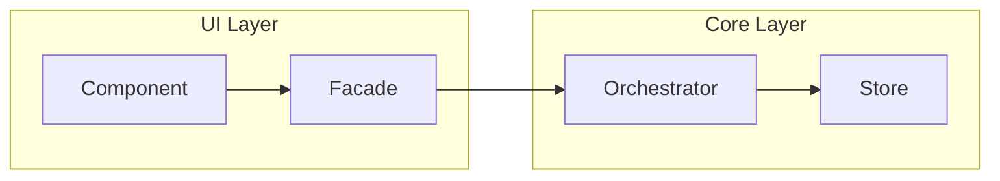

Lecture :

- les `subgraph` servent a regrouper visuellement
- ils n'inversent jamais le sens des fleches
- ils disent "ces elements appartiennent au meme bloc"

Ne lis pas un `subgraph` comme une dependance. Lis-le comme un cadre visuel.

## 8. Construire un graphe complexe pas a pas

Quand tu vois un graphe dense, ne le lis pas comme un bloc.

Le bon reflexe est de le reconstruire mentalement par couches.

### Etape 1 : trouver l'epine dorsale

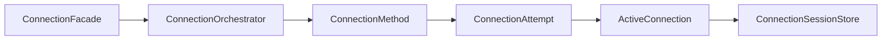

Lecture :

- tout va dans le meme sens
- on peut lire le graphe comme une histoire simple
- `Facade` declenche
- `Orchestrator` coordonne
- `Method` ouvre une tentative
- `Attempt` produit une connexion active
- `Active` alimente le store

Tant que tu n'as pas compris cette ligne principale, n'ajoute pas les fleches de retour.

### Etape 2 : ajouter un premier retour

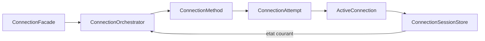

Lecture :

- lis d'abord la ligne principale comme avant
- lis ensuite la nouvelle fleche seule
- `Store --> Orchestrator` veut dire ici : l'etat stocke redevient lisible par l'orchestrateur

Important :

- cette nouvelle fleche ne change pas le sens des autres
- elle ajoute un retour local
- elle ne veut pas dire automatiquement "le store est au-dessus de l'orchestrateur"

### Etape 3 : refermer vers le point d'entree

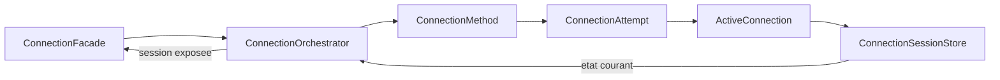

Lecture :

- il y a maintenant un traitement principal vers la droite
- puis un retour d'information vers la gauche logique du diagramme
- `Orchestrator --> Facade` se lit ici comme une restitution du resultat, pas comme une dependance UML classique

Tu peux le raconter ainsi :

1. `Facade` lance le travail
2. le travail avance jusqu'au `Store`
3. l'etat remonte vers `Orchestrator`
4. le resultat final remonte vers `Facade`

### Etape 4 : le graphe final

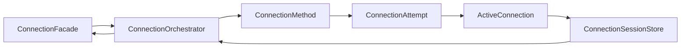

A ce stade, tu peux reconnaitre 3 zones :

- entree : `Facade`
- traitement : `Orchestrator -> Method -> Attempt -> Active`
- stockage puis retour : `Store -> Orchestrator -> Facade`

## 9. Methode pour lire un graphe dense

Quand un schema commence a boucler ou a croiser plusieurs intentions, utilise cette methode :

1. Trouver la ligne principale qui va dans le sens naturel du graphe.
2. Ignorer temporairement les fleches qui repartent "en arriere".
3. Lire la ligne principale comme une phrase continue.
4. Revenir ensuite sur chaque fleche de retour, une par une.
5. Donner un verbe a chaque fleche : `appelle`, `produit`, `stocke`, `retourne`, `lit`, `publie`.
6. Verifier enfin si le schema parle de dependances, d'execution, d'etat, ou d'un melange.

Si tu sautes directement a l'etape 6, c'est la que la confusion UML revient.

## 10. Exemple proche du projet

Lecture conseillee :

1. Lire d'abord `Facade -> Orchestrator -> Method -> Attempt -> Active -> Store`.
2. Lire ensuite `Store -> Orchestrator` comme un retour d'etat.
3. Lire enfin `Orchestrator -> Facade` comme une restitution du resultat.

La bonne interpretation ici est plutot :

- un chemin de traitement principal
- un chemin de retour d'etat
- un resultat qui remonte au point d'entree

La mauvaise interpretation serait :

- supposer que chaque fleche exprime une dependance technique du meme type
- en deduire un diagramme UML strict

Sur ce genre de schema, la phrase la plus utile n'est pas toujours "qui depend de qui ?".

Souvent, la meilleure question est :

`Que se passe-t-il ensuite, et qu'est-ce qui remonte ensuite ?`

## 11. Quand un `flowchart` melange dependances et flux

Beaucoup de graphes de documentation sont hybrides.

Ils montrent en meme temps :

- qui appelle qui
- ou passe l'etat
- ou revient le resultat

Du coup :

- une fleche peut signifier `utilise`
- la suivante peut signifier `produit`
- la suivante peut signifier `retourne`

C'est normal, mais il faut le savoir.

Regle pratique :

- si la fleche raconte une action de traitement, pense `flux`
- si la fleche raconte un besoin structurel stable, pense `dependance`
- si la fleche repart vers l'amont avec un resultat, pense `retour`

C'est pour ca qu'un titre comme `Architecture de flux` ou `Workflow login` aide plus qu'un titre trop vague.

## 12. Les `sequenceDiagram` se lisent autrement

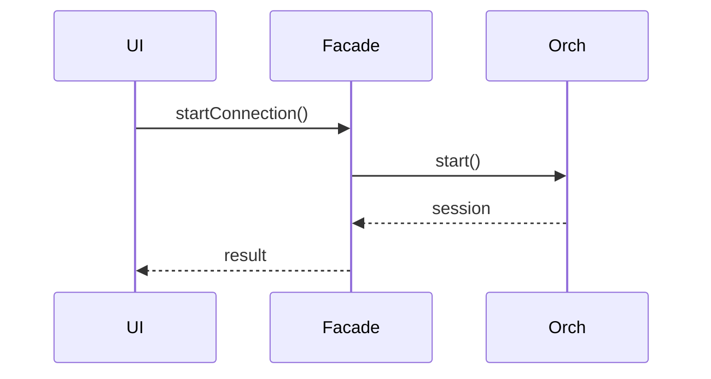

Dans un `sequenceDiagram` :

- les colonnes montrent les acteurs
- le temps descend du haut vers le bas
- chaque fleche est un message envoye a un moment precis

Donc :

- en horizontal : qui parle a qui
- en vertical : dans quel ordre

Ici, la bonne lecture est :

1. `UI` envoie `startConnection()` a `Facade`
2. `Facade` envoie `start()` a `Orch`
3. `Orch` retourne `session`
4. `Facade` retourne `result`

Ce n'est pas un graphe de dependances statiques. C'est un graphe de chronologie.

## Mermaid vs UML

La confusion vient souvent de cette difference :

- UML donne souvent un sens tres precis a la forme des fleches
- Mermaid `flowchart` est plus simple et plus libre

Donc, dans Mermaid :

- la fleche donne la direction
- le contexte du schema donne le sens exact

Bonne pratique de doc :

- annoncer le type du schema dans le titre
- utiliser des labels de fleche si le sens n'est pas evident

Exemples de titres utiles :

- `Architecture de dependances`
- `Flux de login`
- `Sequence de connexion`

## Anti-confusion rapide

Si tu veux savoir si `A` depend de `B`, verifie d'abord que le schema parle bien de dependances ou d'appels.

Ensuite applique cette regle :

- `A --> B` se lit `A` utilise `B`
- donc `A` depend de `B`
- donc un changement dans `B` peut impacter `A`

Et pour relire un schema rapidement :

1. Identifier le type : `flowchart` ou `sequenceDiagram`
2. Identifier l'orientation : `LR` ou `TD`
3. Suivre une fleche a la fois
4. Transformer chaque fleche en phrase
5. Ne pas inventer un sens plus complique que ce que le schema montre

## Version courte a retenir

Pour un `flowchart` :

- la fleche dit "va vers"
- la dependance part de la source vers la cible
- les sorties d'un noeud montrent ce qu'il utilise
- les entrees d'un noeud montrent qui l'utilise

Pour un `sequenceDiagram` :

- gauche/droite = qui parle
- haut/bas = quand ca se passe
