---
stepsCompleted:
  - step-01-validate-prerequisites
  - step-01-requirements-extracted
  - step-02-design-epics
  - step-03-create-stories
  - step-04-final-validation
inputDocuments:
  - _bmad-output/planning-artifacts/prd.md
  - _bmad-output/planning-artifacts/architecture.md
  - _bmad-output/planning-artifacts/ux-design-specification.md
  - _bmad-output/project-context.md
  - docs/README.md
  - docs/product/roadmap.md
  - docs/features/README.md
  - docs/architecture/overview.md
  - docs/architecture/decisions/README.md
  - docs/auth/nostr-auth-rules.md
  - docs/auth/mobile-auth-notes.md
---

# nostr-tools-ng-app - Epic Breakdown

## Overview

This document provides the complete epic and story breakdown for nostr-tools-ng-app, decomposing the requirements from the PRD, UX Design if it exists, and Architecture requirements into implementable stories.

## Requirements Inventory

### Functional Requirements

FR1: Users can sign in with a bunker-based Nostr authentication method.

FR2: Users can sign in with an external signer app.

FR3: Users can sign in with a browser extension signer.

FR4: Users can choose among the supported Nostr authentication methods available to them.

FR5: Users can complete authentication after external permission prompts or approval steps.

FR6: Users can recover from delayed, denied, cancelled, expired, or interrupted authentication attempts.

FR7: Users can see whether authentication is pending, successful, failed, expired, or requires action.

FR8: Users can sign out of the application.

FR9: The system can distinguish identity discovery from active signer authorization.

FR10: The system can distinguish signer availability, signer permission, active session, expired session, and revoked or removed authorization.

FR11: Users remain authenticated after page refresh when signer authorization remains valid.

FR12: Users are no longer treated as authenticated when signer authorization has expired.

FR13: Users are no longer treated as authenticated when signer access has been revoked or removed.

FR14: The system can restore a valid authenticated session without requiring unnecessary re-authentication.

FR15: The system can require re-authentication when the remembered local state is insufficient to prove active authorization.

FR16: The system can preserve in-progress authentication attempts across normal navigation, app switching, and browser focus changes.

FR17: The system can provide a clear recovery path when session restoration cannot complete.

FR18: Authenticated users can request to join the pack.

FR19: The system can automatically add an eligible authenticated user to the pack after request.

FR20: Users can receive confirmation when pack registration succeeds.

FR21: Users can receive a clear message when they are already in the pack.

FR22: The system can process repeated pack registration requests idempotently.

FR23: The system can prevent unauthenticated users from registering for the pack.

FR24: The system can protect pack registration with valid Nostr authorization.

FR25: The system can preserve pack registration behavior after authentication changes.

FR26: Admins can view pack members in the admin panel.

FR27: Admins can identify users who were added through Toolstr.

FR28: Admins can remove users from the pack.

FR29: Admins can verify that auto-registration is working without manually processing normal join requests.

FR30: The system can enforce admin-only access to pack management capabilities.

FR31: Users can see clear status messages during sign-in and pack registration.

FR32: Users can understand when they need to switch to a signer app, approve a permission, return to Toolstr, retry, or choose another method.

FR33: Users can retry authentication after a failed or interrupted attempt.

FR34: Users can retry pack registration after a recoverable failure.

FR35: Users can understand when no further action is needed because they are already registered.

FR36: The system can avoid indefinite loading states by reaching a clear success, failure, pending, timeout, or recovery state.

FR37: The project can preserve critical support knowledge in maintained docs.

FR38: The project can retain Nostr authentication patterns, architecture decisions, research, guides, and incident knowledge needed for BMAD migration.

FR39: The preserved knowledge can support future wiki creation without making the polished wiki part of the current release.

FR40: The current release excludes Nostr account creation tooling.

FR41: The current release excludes broad Nostr onboarding explanations beyond what is needed for supported auth flows.

FR42: The current release excludes broader Toolstr developer tools.

FR43: The current release excludes reusable Angular auth module extraction.

FR44: The current release excludes installable PWA support.

FR45: The current release excludes SEO/public discoverability work.

FR46: The current release excludes polished public developer documentation/wiki delivery.

### NonFunctional Requirements

NFR1: Sign-in completion must not wait on nonessential feed, notification, or broad relay data.

NFR2: Pack registration should complete within 2-3 seconds under normal operating conditions.

NFR3: Auth status changes should become visible to the user promptly after signer approval, denial, timeout, or return-to-app.

NFR4: The app must avoid indefinite loading states during authentication and pack registration.

NFR5: The app must never request, store, transmit, or derive user private keys.

NFR6: Protected backend actions must require valid Nostr authorization and must not rely on UI-only session state.

NFR7: Remembered local state must not be treated as proof of active authentication without valid signer authorization semantics.

NFR8: Admin-only pack management capabilities must remain protected by both frontend and backend authorization checks.

NFR9: Session restoration must stop treating a user as authenticated when authorization is expired, revoked, removed, or unavailable.

NFR10: Bunker, external signer app, and browser extension authentication must each be validated as supported flows.

NFR11: Authentication attempts must survive normal desktop and mobile focus transitions, app switching, permission prompts, delayed approvals, denials, cancellations, and timeouts.

NFR12: Page refresh must preserve valid authenticated state when signer authorization remains valid.

NFR13: Authentication failures must resolve to an explicit user-visible state: recoverable error, retry, timeout, cancellation, expired authorization, or sign-out.

NFR14: Pack registration must be idempotent for users already in the pack.

NFR15: Auth changes must not regress existing pack registration, admin removal, or the accepted redesign.

NFR16: Core authentication and pack registration flows must meet WCAG AA expectations.

NFR17: Status, error, pending, success, and recovery messages must be perceivable and understandable without relying only on color.

NFR18: Interactive controls in auth and pack registration flows must be keyboard operable and have visible focus states.

NFR19: External signer guidance must be clear enough for users to understand the required next action.

NFR20: Browser extension signer integration must handle unavailable extension, approval, denial, permission changes, and refresh behavior.

NFR21: External signer app integration must handle app switching, delayed response, cancellation, and return-to-app behavior.

NFR22: Bunker integration must handle remote approval, relay availability issues, delayed completion, and authorization persistence.

NFR23: Backend pack registration must remain compatible with the current Nostr signed authorization model.

NFR24: Admin pack management must remain consistent with backend membership state.

### Additional Requirements

AR1: Continue from the existing brownfield Angular/Bun foundation; do not initialize a new starter, migrate frameworks, or run a project initialization command.

AR2: Use Angular 21, strict TypeScript, standalone components by default, signals, OnPush change detection, Bun scripts, Tailwind CSS, DaisyUI, Transloco, NDK, nostr-tools, and Vitest as established project foundations.

AR3: Preserve feature-first pseudo-DDD boundaries: `domain` for pure business rules, `application` for orchestration and ports, `infrastructure` for signer/relay/HTTP/persistence adapters, and `presentation` for Angular UI.

AR4: Keep page components thin; Angular presentation code must not contain raw signer, relay, NDK, NIP-98, Supabase, or backend authorization logic.

AR5: Define or consolidate a single shared auth/session state model in `src/core/nostr-connection/domain/` before broad auth UI or pack-registration changes.

AR6: Model authentication as explicit states covering disconnected, detecting signer, awaiting permission, awaiting external signer approval, awaiting bunker approval, connected, restoring, expired, revoked or unavailable, cancelled, timed out, failed, and recoverable retry.

AR7: Implement browser extension, external signer app, and bunker behavior as infrastructure adapters behind a common application-facing port.

AR8: Treat local remembered identity or profile data as restorable context only; it must never be proof of active authentication.

AR9: Do not introduce backend sessions, cookies, JWT login, OAuth replacement, or server-side identity state without a new product and architecture decision.

AR10: Protected backend actions, including pack registration and admin operations, must include NIP-98 authorization generated from the current signer and validated by the Bun API.

AR11: Keep Supabase access server-side only through `server.mjs`; Angular must not import Supabase clients, expose service-role or secret keys, or write directly to Supabase.

AR12: Separate runtime auth/session state from persisted pack membership state; do not model the MVP as a persisted backend login session.

AR13: Keep pack registration idempotent, including already-in-pack handling, and protect it through backend authorization rather than UI state.

AR14: Backend API errors must use a stable safe format: `{ error: { code, message, recoverable } }`, with stable snake_case error codes and no raw stack traces, Supabase details, NIP-98 tokens, or signer secrets.

AR15: Use REST-style request/response APIs for MVP pack registration and admin flows; no GraphQL, WebSocket, realtime, or broad event bus is required for this release.

AR16: API payloads exposed to Angular use camelCase, database columns use snake_case, dates use ISO 8601 strings, and `pubkey` hex identity must stay distinct from display `npub` values.

AR17: Use private writable signals and public readonly/computed signals for frontend application/session state projection.

AR18: Sign-in completion must be decoupled from profile, relay, feed, notification, or discovery data loading.

AR19: Logging must support auth and registration diagnosis without exposing secrets, raw authorization tokens, service-role keys, NIP-46 secrets, bunker tokens, auth URLs, or sensitive signer material.

AR20: Existing `server.mjs` route names and behavior must be aligned during implementation rather than blindly renamed to match architecture examples.

AR21: Tests must be co-located as `*.spec.ts`; domain tests should avoid Angular TestBed, application tests should use fake ports/signers, UI tests should assert visible states, and backend tests should cover authorization and membership behavior where infrastructure exists.

AR22: Use repository scripts for verification, especially `bun run test`, `bun run check`, `bun run build`, `bun run lint`, `bun run lint:css`, `bun run typecheck`, and `bun run fix`; do not call underlying tools directly.

AR23: Translation/copy changes must update the relevant `src/assets/i18n/fr.json`, `en.json`, and `es.json` files.

AR24: Maintained project documentation lives in `docs/`; `docs/product/roadmap.md` owns sequencing and `docs/features/README.md` owns feature briefs.

AR25: Preserve useful legacy planning knowledge in maintained docs; surviving principles reinforce Angular discipline, accessibility, feature boundaries, Nostr auth/security, and repo-script verification.

AR26: Exclude obsolete planning templates, commands, extensions, and generated scaffolding from future product planning after preserved knowledge is migrated.

AR27: M1 execution order starts with `001-auto-admit-pack-members`, then `002-session-restore`, `003-extension-auth-loading`, `004-advanced-bunker-mode`, followed by mobile auth, async-button, permission, mobile state, and bunker permission work according to `queue.md`.

AR28: Auto-admit pack membership must store member rows in Supabase with `pubkey`, profile snapshot fields, join metadata, public counters when available, app-origin metadata, removal metadata, and documented environment variables.

AR29: Admin pack management must replace approve/reject moderation with a members table and a protected remove-from-pack action while preserving audit/history through `removedAt` or equivalent removal state.

AR30: Session restore must restore only valid NIP-07 or NIP-46 authorizations, purge invalid persisted restore payloads, and fail closed to disconnected state when trust cannot be established.

AR31: Extension authentication loading should first be implemented locally in the auth modal with loading, disabled, accessible label, re-entry guard, and reset coverage before introducing any shared abstraction.

AR32: `bunker://` must remain available and functional for advanced users, but it must be visually and textually separate from the mainstream mobile external signer path.

AR33: Amber and Primal mobile auth behavior must be manually verified and documented across waiting, success, refusal, timeout, refresh, return-to-site, and app-specific limitation states.

AR34: A shared async-button pattern may be introduced only after at least three real async button cases are inventoried and abstraction demonstrably reduces duplication.

AR35: Permission minimization must inventory current startup permissions, map every permission to a concrete feature need, reduce startup scope where safe, and move additional permissions to just-in-time prompts where possible.

AR36: Bunker one-shot permission grants remain blocked until NDK exposes a clean extension point or the feature is explicitly superseded by a documented replacement.

AR37: NIP-46 flows must validate `secret`, correlate response IDs, handle `auth_url` as `authUrl` where exposed to the app, request minimal permissions, time out stale attempts, and clean transient state on completion, failure, cancellation, and logout.

AR38: NIP-98 verification must validate kind `27235`, `created_at` freshness, exact URL, exact method, payload when applicable, and event signature, returning `401 Unauthorized` for invalid tokens.

AR39: Future M2 follower merge work must remain admin-only, load source and target packs, normalize pubkeys, separate importable/already-present/target-only members, preview safely, and remain non-destructive by default.

AR40: Future M3 pack feed work must provide a public read-only kind 1 feed from pack members, sorted chronologically descending, with pagination or load-more and no complex social engine in the first version.

### UX Design Requirements

UX-DR1: Preserve the existing Tailwind CSS and DaisyUI `brutal` visual foundation for MVP work; do not introduce a new design system, color palette, typography system, broad layout redesign, or visual direction.

UX-DR2: Keep the core flow focused on one primary path: connect, show connected identity, join the francophone pack, confirm success or already-in-pack, then redirect or offer open-pack action.

UX-DR3: The pack page must keep join unavailable until authentication succeeds, either disabled with explanation or guiding the user to connect first.

UX-DR4: Remove fake captcha or unnecessary validation from pack joining; an authenticated eligible user should join without an extra validation step.

UX-DR5: After successful pack joining, show a concise success message and redirect the user to the pack on `following.space` when appropriate.

UX-DR6: Already-in-pack state must be presented as calm success-like confirmation with no further action required, not as an error.

UX-DR7: Authentication method selection must help users choose without protocol expertise, using user-facing labels such as browser extension, mobile signer app, and bunker.

UX-DR8: Desktop UX should favor browser extension authentication, mobile UX should favor external signer app authentication, and bunker should remain available where appropriate.

UX-DR9: Private-key login, if retained, must be hidden behind an explicit advanced or reveal interaction and must not appear as a normal primary login method.

UX-DR10: The signed-in identity summary must show visible profile identity after successful or restored authentication, including readable identity text and not relying only on avatar imagery.

UX-DR11: Signer pending states must name what is happening: waiting for browser extension approval, waiting for mobile signer app approval, waiting for bunker approval, delayed, cancelled, denied, or timed out.

UX-DR12: Pending signer UI must include concise action-oriented guidance, optional loading indicator, cancellation where relevant, and retry or choose-another-method recovery when needed.

UX-DR13: Session restore UX should prefer silent successful restoration, visibly confirm connection through identity/action state, and interrupt only when reconnection is required.

UX-DR14: Session restore failure states must distinguish expired, revoked, unavailable, and reconnect-required outcomes enough for the user to know the next action.

UX-DR15: Pack join status UI must cover not connected, can join, joining, joined, already in pack, failed, retry available, and redirecting states.

UX-DR16: Minimal recovery messages must provide one concise message, one primary next action, and only a useful optional secondary action.

UX-DR17: Recovery copy should avoid protocol-heavy diagnostics by default and use practical messages such as reconnect, try again, choose another method, retry pack joining, or open pack.

UX-DR18: Each flow state should expose one obvious primary action whenever possible: connect, join pack, retry connection, reconnect, or open pack.

UX-DR19: Disabled actions must explain what is required before they become available, especially join actions blocked by missing authentication.

UX-DR20: All buttons and interactive auth/pack controls must be keyboard-operable, have visible focus states, and expose accessible labels during loading or disabled states.

UX-DR21: Status, pending, error, success, and recovery feedback must be perceivable without relying only on color and should remain understandable to screen-reader users.

UX-DR22: Mobile responsive behavior must validate app switching, browser focus changes, return-to-Toolstr behavior, and recovery after signer approval, denial, timeout, or interruption.

UX-DR23: The auth modal may remain the default MVP pattern, but mobile implementation may pragmatically adapt it toward a full-screen dialog-like experience if real signer usability requires it.

UX-DR24: MVP validation must include desktop browser extension authentication, mobile external signer authentication, bunker authentication, page refresh after authentication, return-to-app behavior, denied/cancelled/expired/unavailable/timeout states, pack joining, already-in-pack handling, and redirect to `following.space`.

UX-DR25: The product copy should make the pack value clear: helping users discover and be discovered by French-speaking Nostr users, without overpromising a full community or feed experience in MVP.

UX-DR26: Future home/landing modules must avoid overselling availability, keep explicit module statuses, preserve the starter pack as the primary module while it remains the main path, and avoid returning to an overly yellow/orange full-page palette.

### FR Coverage Map

FR1: Epic 1 - Bunker-based Nostr authentication.

FR2: Epic 1 - External signer app authentication.

FR3: Epic 1 - Browser extension signer authentication.

FR4: Epic 1 - Supported authentication method selection.

FR5: Epic 1 - External permission and approval completion.

FR6: Epic 1 - Recovery from delayed, denied, cancelled, expired, or interrupted authentication attempts.

FR7: Epic 1 - Visible authentication status.

FR8: Epic 1 - Sign out.

FR9: Epic 1 - Distinguish identity discovery from active signer authorization.

FR10: Epic 1 - Distinguish signer availability, signer permission, active session, expired session, and revoked or removed authorization.

FR11: Epic 1 - Valid refresh restoration.

FR12: Epic 1 - Stop treating expired authorization as authenticated.

FR13: Epic 1 - Stop treating revoked or removed signer access as authenticated.

FR14: Epic 1 - Restore valid authenticated sessions without unnecessary re-authentication.

FR15: Epic 1 - Require re-authentication when remembered local state is insufficient.

FR16: Epic 1 - Preserve in-progress authentication attempts across navigation, app switching, and focus changes.

FR17: Epic 1 - Clear recovery path when session restoration cannot complete.

FR18: Epic 2 - Authenticated pack join request.

FR19: Epic 2 - Automatic eligible user admission.

FR20: Epic 2 - Pack registration success confirmation.

FR21: Epic 2 - Clear already-in-pack message.

FR22: Epic 2 - Idempotent repeated pack registration requests.

FR23: Epic 2 - Prevent unauthenticated pack registration.

FR24: Epic 2 - Protect pack registration with valid Nostr authorization.

FR25: Epic 2 - Preserve pack registration behavior after authentication changes.

FR26: Epic 2 - Admin pack member view.

FR27: Epic 2 - Identify users added through Toolstr.

FR28: Epic 2 - Admin member removal.

FR29: Epic 2 - Admin verification that auto-registration works without manual request processing.

FR30: Epic 2 - Admin-only pack management enforcement.

FR31: Epic 1 and Epic 2 - Clear status messages during sign-in and pack registration.

FR32: Epic 1 - Guidance for signer app switching, approval, return, retry, and alternate methods.

FR33: Epic 1 - Retry authentication after failed or interrupted attempts.

FR34: Epic 2 - Retry pack registration after recoverable failure.

FR35: Epic 2 - Communicate that no further action is needed when already registered.

FR36: Epic 1 and Epic 2 - Avoid indefinite loading states by reaching explicit terminal or recovery states.

FR37: Epic 3 - Preserve critical support knowledge in maintained docs.

FR38: Epic 3 - Retain Nostr authentication patterns, architecture decisions, research, guides, and incident knowledge for BMAD migration.

FR39: Epic 3 - Preserve knowledge for future wiki creation without making the polished wiki part of the release.

FR40: Epic 3 - Exclude Nostr account creation tooling from the current release.

FR41: Epic 3 - Exclude broad Nostr onboarding beyond what is needed for supported auth flows.

FR42: Epic 3 - Exclude broader Toolstr developer tools from the current release.

FR43: Epic 3 - Exclude reusable Angular auth module extraction from the current release.

FR44: Epic 3 - Exclude installable PWA support from the current release.

FR45: Epic 3 - Exclude SEO and public discoverability work from the current release.

FR46: Epic 3 - Exclude polished public developer documentation/wiki delivery from the current release.

## Epic List

### Epic 1: Reliable Nostr Authentication and Session Continuity

Users can sign in with supported Nostr methods, stay connected when authorization remains valid, and recover clearly from interrupted or expired auth states.

**FRs covered:** FR1-FR17, FR31-FR33, FR36

### Epic 2: Francophone Pack Membership and Admin Oversight

Authenticated users can join the francophone pack immediately, understand success or already-in-pack states, and admins can manage members safely.

**FRs covered:** FR18-FR31, FR34-FR36

### Epic 3: BMAD Knowledge Preservation and Scope Control

The project preserves useful legacy planning knowledge, removes obsolete scaffolding from active planning, and keeps the current release focused on the MVP.

**FRs covered:** FR37-FR46

## Epic 1: Reliable Nostr Authentication and Session Continuity

Users can sign in with supported Nostr methods, stay connected when authorization remains valid, and recover clearly from interrupted or expired auth states.

### Story 1.1: Define Shared Auth Session State Model

**Requirements covered:** FR7, FR9, FR10, FR15, FR36

As a Nostr user,
I want the app to represent my connection state consistently,
So that I am never shown a misleading signed-in, loading, failed, or recovery state.

**Acceptance Criteria:**

**Given** the app needs to represent Nostr authentication
**When** the shared auth/session state model is defined
**Then** it includes explicit states for disconnected, detecting signer, awaiting permission, awaiting external signer approval, awaiting bunker approval, connected, restoring, expired, revoked or unavailable, cancelled, timed out, failed, and recoverable retry
**And** the model is the single shared source for auth status semantics.

**Given** remembered identity or profile data exists locally
**When** the app evaluates authentication state
**Then** local data is treated only as restorable context
**And** it never marks the user connected without valid signer authorization semantics.

**Given** UI components render auth state
**When** connected, pending, failed, timeout, cancellation, expired, revoked, or retry states appear
**Then** they derive from the shared auth/session model
**And** they do not duplicate loose auth booleans or raw signer checks.

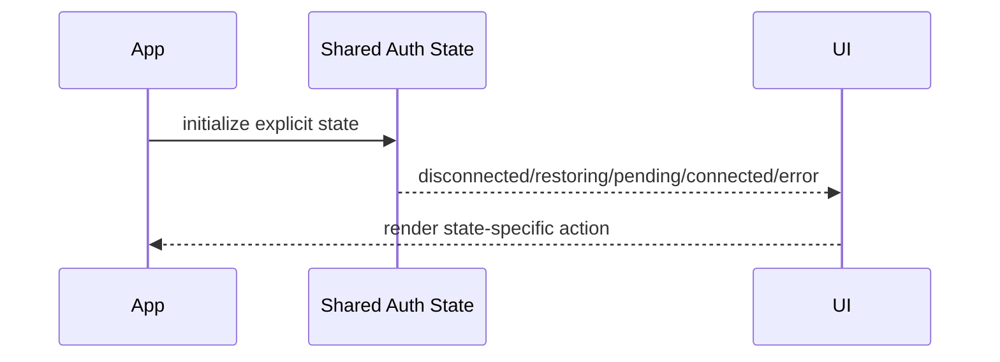

### Story 1.2: Restore Valid Browser Extension Sessions After Refresh

**Requirements covered:** FR3, FR11, FR12, FR13, FR14, FR15, FR17

As a desktop Nostr user,
I want my valid browser extension session to survive refresh,
So that I do not need to reconnect unnecessarily.

**Acceptance Criteria:**

**Given** a user previously connected with a browser extension signer
**When** the page refreshes and signer authorization remains valid
**Then** the app restores or revalidates the session
**And** the user sees connected identity and available actions.

**Given** the extension is unavailable, revoked, changed, or cannot validate the user
**When** session restoration runs
**Then** the app returns to disconnected or reconnect-required state
**And** cached profile data alone is not treated as authentication.

**Given** restore succeeds or fails
**When** auth state changes
**Then** the state resolves without indefinite loading
**And** tests cover valid restore, unavailable extension, and invalid local state.

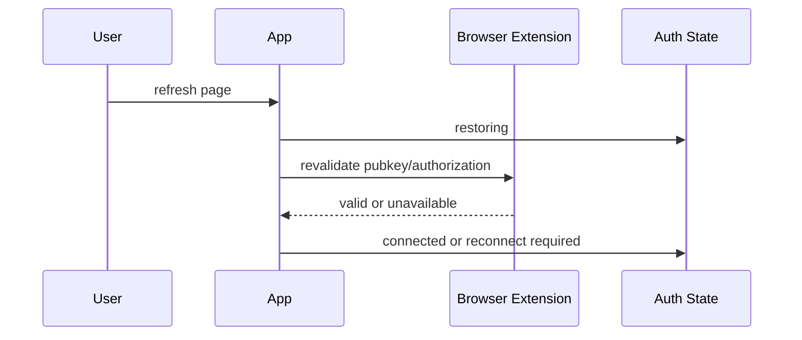

### Story 1.3: Restore Valid NIP-46 External Signer Sessions After Refresh

**Requirements covered:** FR2, FR5, FR11, FR12, FR13, FR14, FR15, FR17

As a mobile Nostr user,
I want my valid external signer authorization to survive refresh where supported,
So that returning to Toolstr does not force a full new pairing.

**Acceptance Criteria:**

**Given** a user connected through NIP-46 external signer flow
**When** the app reloads with a valid restore payload
**Then** the app attempts silent signer restoration
**And** restores connected state only after signer authorization is validated.

**Given** the restore payload is missing, invalid, expired, revoked, or unsupported by the signer
**When** restoration runs
**Then** the app purges invalid restore data
**And** shows disconnected or reconnect-required state.

**Given** restoration uses NIP-46 data
**When** protocol correlation is required
**Then** `secret`, request identity, timeout behavior, and signer pubkey validation are respected
**And** sensitive restore values are not exposed in logs.

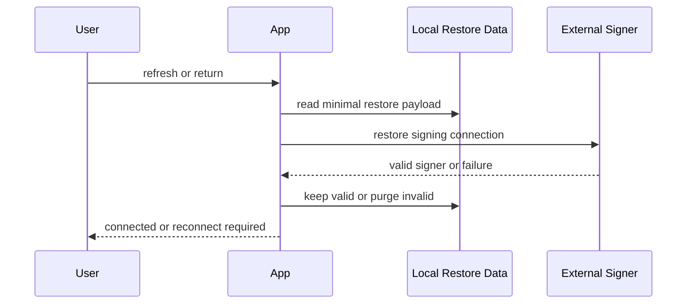

### Story 1.4: Make Auth Method Selection and Advanced Bunker Mode Clear

**Requirements covered:** FR1, FR2, FR3, FR4

As a Nostr user,
I want the app to guide me toward the right sign-in method,
So that I can connect without understanding protocol details.

**Acceptance Criteria:**

**Given** a disconnected user opens the auth modal
**When** auth methods are shown
**Then** desktop users are guided toward browser extension auth
**And** mobile users are guided toward external signer app auth.

**Given** bunker auth remains supported
**When** the auth modal displays bunker access
**Then** `bunker://` is labeled and positioned as advanced
**And** existing bunker functionality remains available.

**Given** private-key login exists in the app
**When** auth options are displayed
**Then** private-key login is not presented as a normal primary method
**And** it is hidden behind an explicit advanced/reveal interaction if retained.

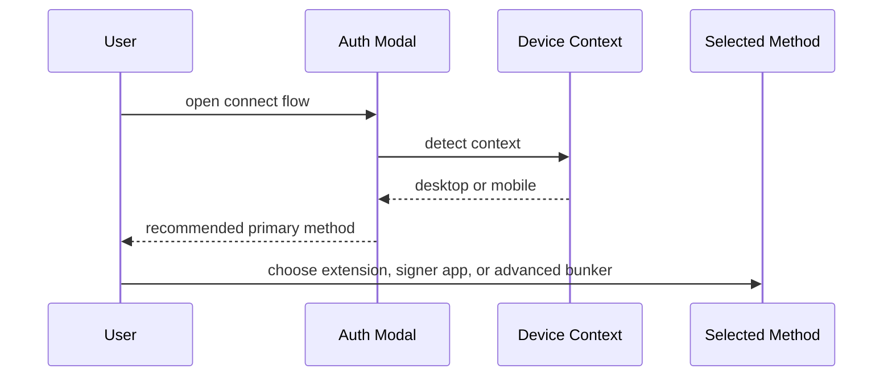

### Story 1.5: Add Explicit Pending, Timeout, Cancelled, Denied, and Retry States

**Requirements covered:** FR5, FR6, FR7, FR16, FR17, FR31, FR32, FR33, FR36

As a Nostr user,
I want every auth attempt to show what is happening and what I can do next,
So that I am not stuck in unclear loading states.

**Acceptance Criteria:**

**Given** a user starts browser extension, external signer, or bunker auth
**When** the app waits for approval
**Then** the UI names the pending reason: extension approval, mobile signer approval, or bunker approval
**And** the state is perceivable without relying only on color.

**Given** an auth attempt is denied, cancelled, timed out, expired, or interrupted
**When** the app receives or infers that result
**Then** the UI shows a concise recovery message
**And** offers retry, reconnect, cancel, or choose another method where relevant.

**Given** an auth attempt is pending
**When** it cannot complete successfully
**Then** it transitions to a terminal or recoverable state
**And** it never remains in indefinite loading.

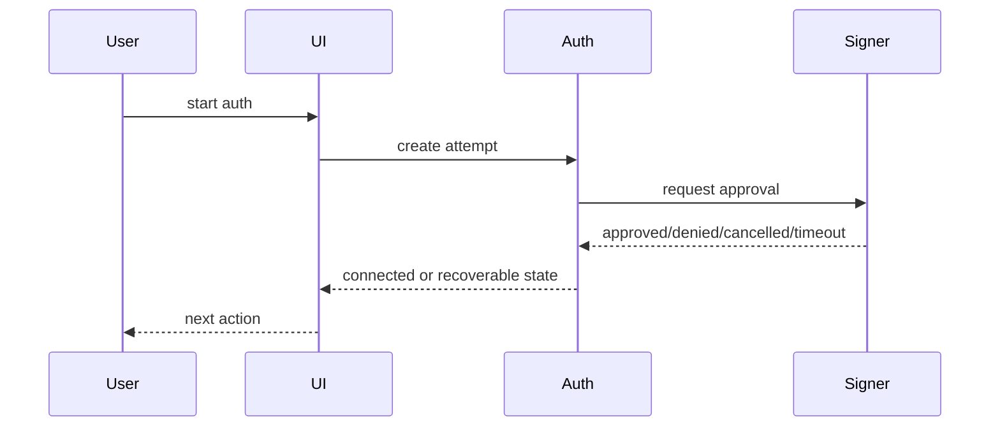

### Story 1.6: Stabilize Mobile External Signer Return Flow for Amber and Primal

**Requirements covered:** FR2, FR5, FR6, FR16, FR17, FR31, FR32, FR33

As a mobile Nostr user,
I want Toolstr to handle app switching and return from my signer app reliably,
So that mobile authentication feels stable instead of fragile.

**Acceptance Criteria:**

**Given** a mobile user starts external signer authentication
**When** the user switches to Amber or Primal and returns to Toolstr
**Then** the app preserves the auth attempt state
**And** completes the session when signer approval succeeds.

**Given** Amber or Primal approval is delayed, denied, cancelled, expired, or interrupted
**When** the user returns to Toolstr
**Then** the app displays a clear state and recovery action
**And** app-specific limitations are documented.

**Given** the mobile flow is implemented or adjusted
**When** validation is performed
**Then** Amber and Primal are manually verified across waiting, success, refusal, timeout, refresh, and return-to-site states
**And** verification notes are preserved in project documentation.

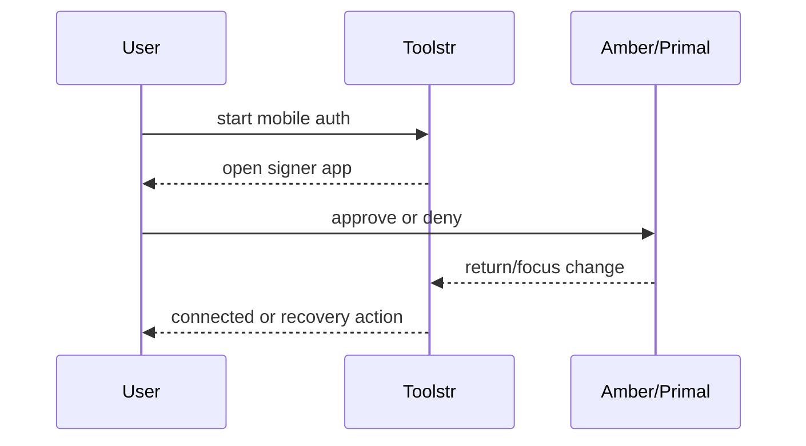

### Story 1.7: Minimize Startup Permissions and Request Additional Permissions Just-In-Time

**Requirements covered:** FR5, FR6, FR32

As a Nostr user,
I want Toolstr to ask only for permissions it needs now,
So that I can trust the connection request.

**Acceptance Criteria:**

**Given** the app requests signer permissions during startup auth
**When** current requested permissions are reviewed
**Then** each permission is mapped to a concrete feature need
**And** unnecessary startup permissions are removed where safe.

**Given** a later action requires additional permission
**When** the user initiates that action
**Then** the app requests the additional permission just in time
**And** the prompt remains understandable on desktop and mobile.

**Given** permissions are reduced
**When** browser extension, external signer, and bunker flows are validated
**Then** required MVP auth and pack actions still work
**And** behavior is covered by tests or explicit manual verification.

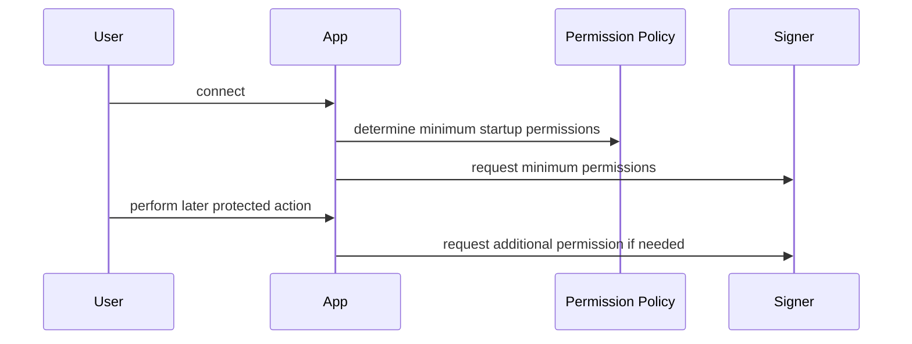

### Story 1.8: Add Accessible Auth Loading and Anti-Duplicate-Submit Behavior

**Requirements covered:** FR3, FR7, FR31, FR33, FR36

As a Nostr user,
I want auth buttons to show loading and prevent duplicate submissions,
So that connection attempts feel responsive and do not accidentally run twice.

**Acceptance Criteria:**

**Given** a user clicks the browser extension auth button
**When** the auth attempt starts
**Then** the button shows accessible loading feedback
**And** duplicate clicks are prevented while the attempt is pending.

**Given** the auth attempt succeeds, fails, is cancelled, or times out
**When** the attempt resolves
**Then** the loading and disabled state resets correctly
**And** the user sees the next connected or recovery state.

**Given** repeated async button behavior exists in at least three real auth or pack actions
**When** a shared async-button pattern is considered
**Then** abstraction is introduced only if it reduces duplication
**And** it preserves accessible labels, visible text, keyboard operability, and anti-double-submit behavior.

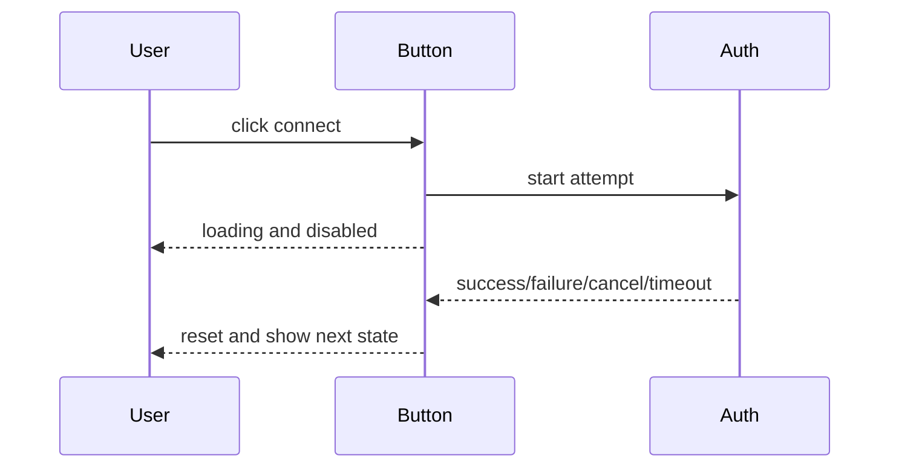

### Story 1.9: Sign Out and Clear Auth Artifacts

**Requirements covered:** FR8, FR10, FR13, FR15

As a signed-in Nostr user,
I want to sign out cleanly,
So that Toolstr no longer treats me as authenticated or keeps stale signer state.

**Acceptance Criteria:**

**Given** a user is connected through browser extension, external signer app, or bunker
**When** the user signs out
**Then** the app returns to disconnected state
**And** protected actions such as pack join require reconnecting.

**Given** there are active or persisted auth artifacts
**When** sign-out completes
**Then** active attempts, transient signer state, local NIP-46 restore data where appropriate, timers, callbacks, auth URLs, and pending UI states are cleaned up
**And** no cached profile data keeps the user signed in.

**Given** sign-out cleanup runs
**When** logs or errors are produced
**Then** sensitive values such as NIP-46 secrets, bunker tokens, auth URLs, and NIP-98 tokens are not exposed.

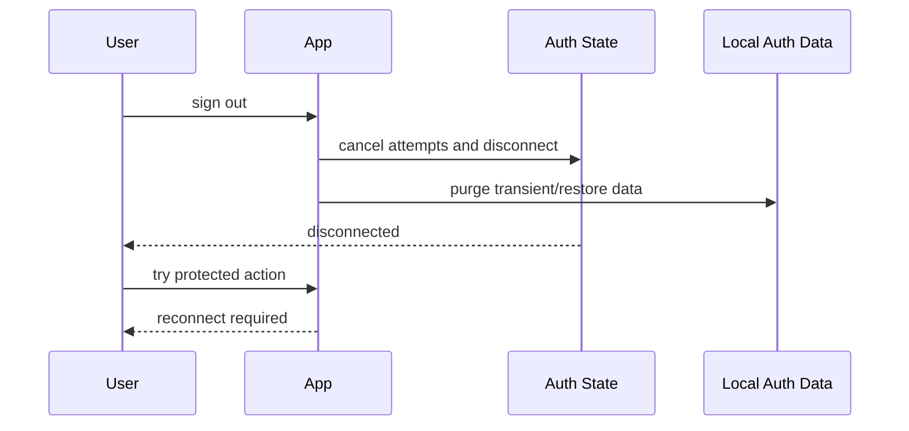

## Epic 2: Francophone Pack Membership and Admin Oversight

Authenticated users can join the francophone pack immediately, understand success or already-in-pack states, and admins can manage members safely.

### Story 2.1: Auto-Admit Authenticated Users Into the Francophone Pack

**Requirements covered:** FR18, FR19, FR23, FR24

As an authenticated Nostr user,
I want to join the francophone pack immediately after clicking join,
So that I do not need to wait for manual admin approval.

**Acceptance Criteria:**

**Given** a user is authenticated with valid Nostr authorization
**When** the user clicks the francophone pack join action
**Then** the system automatically admits the user into the pack
**And** no manual approve/reject step is required for the main join workflow.

**Given** the user is not authenticated or cannot produce valid Nostr authorization
**When** the user attempts to join the pack
**Then** the join is blocked
**And** the user is guided to connect or reconnect.

**Given** the join operation is protected
**When** the frontend sends the join request to the backend
**Then** it includes valid NIP-98 authorization
**And** the backend validates authorization before changing membership state.

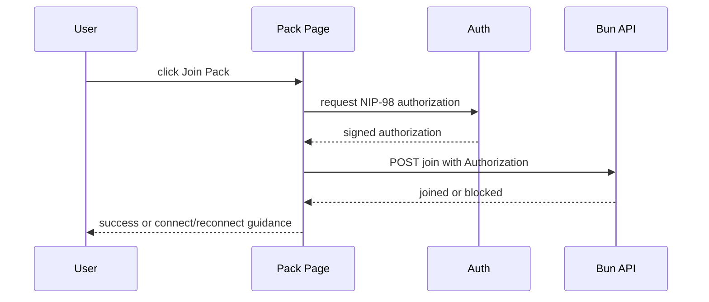

### Story 2.2: Persist Francophone Pack Members in Supabase

**Requirements covered:** FR19, FR25, FR27, FR29

As an admin,
I want pack membership stored persistently,
So that member data survives redeployments and can be audited.

**Acceptance Criteria:**

**Given** a user is admitted into the francophone pack
**When** membership is stored
**Then** Supabase records the user by stable hex `pubkey`
**And** Angular does not access Supabase directly.

**Given** public profile and counter data are available
**When** the member record is created or updated
**Then** it stores username, description, avatar URL, joined date, follower count, following count, account creation date when inferable, post count, zap count when visible, requested-from-app, and requested-at metadata
**And** unavailable values are stored as unknown or null without blocking admission.

**Given** deployment or server restart occurs
**When** members are listed after redeploy
**Then** member data remains available from Supabase
**And** legacy runtime SQLite storage is not the source of truth for this flow.

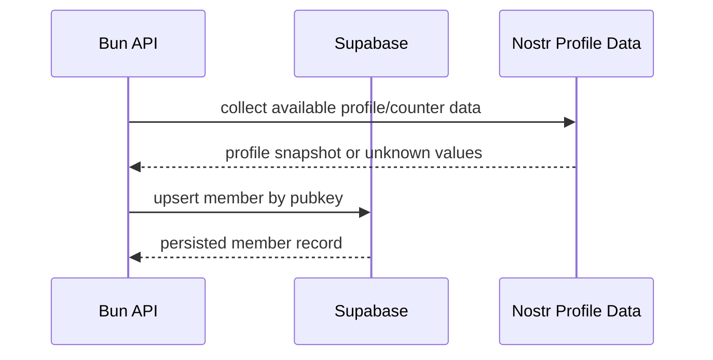

### Story 2.3: Handle Already-In-Pack and Repeated Join Requests Idempotently

**Requirements covered:** FR21, FR22, FR35

As a Nostr user,
I want repeated join attempts to be handled calmly,
So that I understand I am already included and no further action is needed.

**Acceptance Criteria:**

**Given** a user is already in the francophone pack
**When** the user clicks join again or repeats a join request
**Then** the system returns an already-in-pack outcome
**And** it does not create duplicate active membership state.

**Given** an already-in-pack outcome is returned
**When** the pack page renders the result
**Then** the user sees a success-like confirmation
**And** the state is not presented as an error.

**Given** repeated requests occur because of retry, refresh, or duplicate submission
**When** the backend processes them
**Then** membership state remains consistent
**And** user-facing status reaches a clear terminal state.

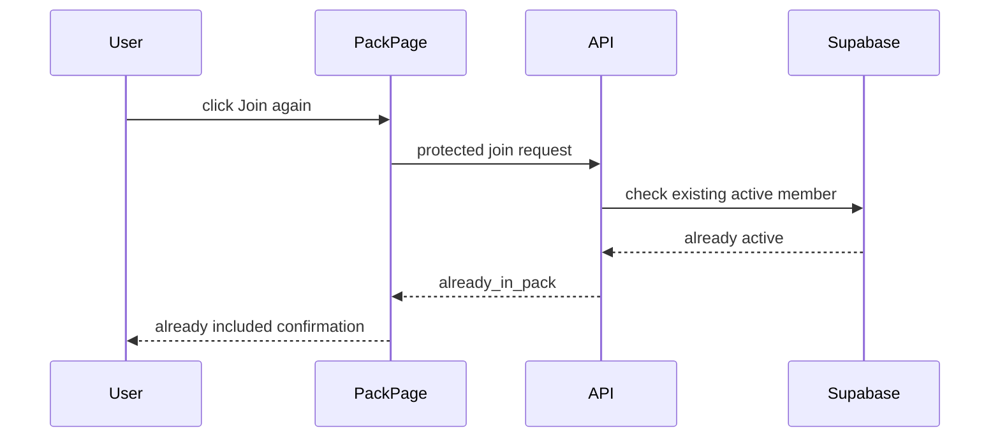

### Story 2.4: Show Clear Pack Join Success, Failure, Retry, and Redirect States

**Requirements covered:** FR20, FR31, FR34, FR35, FR36

As a Nostr user,
I want pack registration feedback to be clear and fast,
So that I know whether I joined, need to retry, or can open the pack.

**Acceptance Criteria:**

**Given** pack joining succeeds
**When** the app receives the success response
**Then** it shows a concise success message
**And** redirects to the pack on `following.space` when appropriate.

**Given** pack joining fails with a recoverable error
**When** the error is shown
**Then** the user sees one clear recovery action such as retry, reconnect, or choose another method
**And** raw protocol, Supabase, stack trace, or signer details are not exposed.

**Given** pack joining is pending
**When** the operation is in progress
**Then** the UI names the state as joining pack or redirecting to pack
**And** it does not show an ambiguous indefinite loading state.

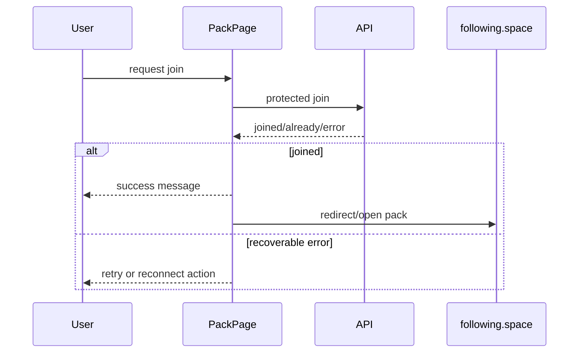

### Story 2.5: Replace Admin Request Moderation With Member Oversight

**Requirements covered:** FR26, FR27, FR29, FR30

As an admin,
I want to view current francophone pack members,
So that I can verify auto-registration without manually approving normal joins.

**Acceptance Criteria:**

**Given** an admin opens the protected admin members page
**When** the member list loads
**Then** the admin sees current francophone pack members from backend/Supabase state
**And** pending-request approve/reject is no longer the primary admin workflow.

**Given** member records include available profile and join metadata
**When** the admin table renders
**Then** it shows avatar, username, profile description, account creation date when available, requested-from-app status, requested/joined-at date, and remove action.

**Given** a non-admin attempts to access member oversight
**When** the route or backend endpoint is used
**Then** frontend affordances are blocked where applicable
**And** backend authorization remains authoritative.

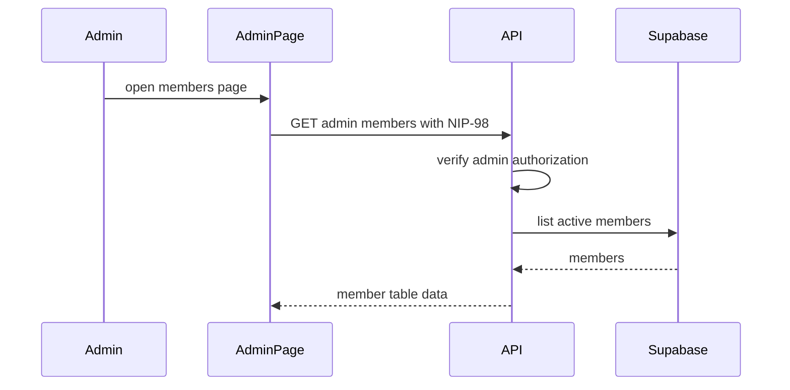

### Story 2.6: Remove Members While Preserving Audit History

**Requirements covered:** FR28, FR30

As an admin,
I want to remove a user from the francophone pack,
So that I can manage membership while retaining a record of what happened.

**Acceptance Criteria:**

**Given** an admin views an active member
**When** the admin chooses remove from pack
**Then** the backend performs the protected removal action
**And** the member is no longer active in the pack.

**Given** a member is removed
**When** the record is updated
**Then** the database preserves audit/history information such as `removedAt` or equivalent removal state
**And** the member row is not silently deleted if history is required.

**Given** removal is attempted by a non-admin or invalidly authorized request
**When** the backend validates the request
**Then** it rejects the action
**And** returns a stable safe error response.

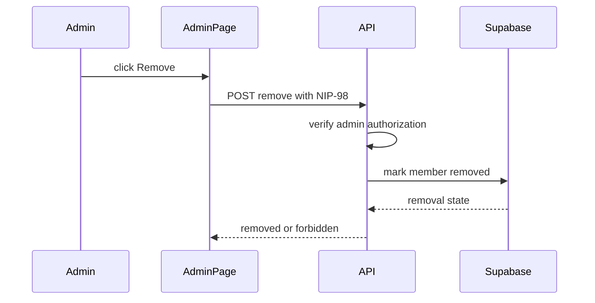

### Story 2.7: Document Supabase Membership Configuration and Runtime Boundaries

**Requirements covered:** FR25, FR37, FR38

As a maintainer,
I want membership persistence and environment configuration documented,
So that deployment and future agents do not regress storage or security boundaries.

**Acceptance Criteria:**

**Given** Supabase membership persistence is used
**When** documentation is updated
**Then** required server-side environment variables are listed
**And** Angular is explicitly documented as not accessing Supabase directly.

**Given** the old runtime SQLite/request model is retired or demoted
**When** docs describe the membership flow
**Then** Supabase is named as the source of truth
**And** obsolete approve/reject or SQLite instructions are removed or marked legacy where relevant.

**Given** future agents inspect architecture and feature docs
**When** they read the updated material
**Then** they can identify the backend API boundary, NIP-98 protection, Supabase persistence, admin authorization, and manual verification expectations.

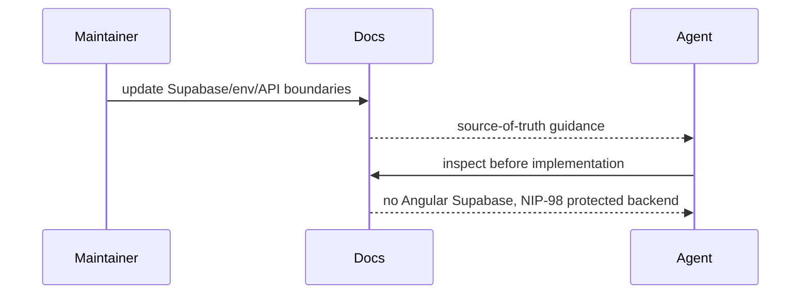

## Epic 3: BMAD Knowledge Preservation and Scope Control

The project preserves useful legacy planning knowledge, removes obsolete scaffolding from active planning, and keeps the current release focused on the MVP.

### Story 3.1: Preserve Useful Legacy Planning Knowledge

**Requirements covered:** FR37, FR38

As a maintainer,
I want useful legacy planning knowledge retained in the active BMAD/project docs,
So that deleting obsolete scaffolding does not lose important Nostr auth or process constraints.

**Acceptance Criteria:**

**Given** legacy planning artifacts still exist
**When** the project prepares to remove obsolete scaffolding
**Then** useful surviving knowledge is reviewed
**And** any still-relevant principles are preserved in BMAD/project docs before deletion.

**Given** preserved knowledge overlaps with current project rules
**When** it is migrated or acknowledged
**Then** Angular discipline, accessibility, feature boundaries, Nostr auth/security, and repo-script verification remain represented in active docs
**And** duplicate failed-tooling instructions are not carried forward unnecessarily.

**Given** legacy support knowledge includes auth patterns, architecture decisions, research, guides, history, and incidents
**When** preservation is complete
**Then** the active source of truth can still answer implementation questions without relying on obsolete tooling.

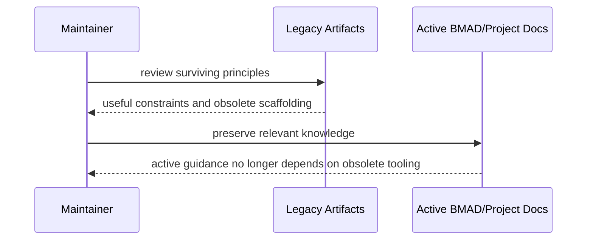

### Story 3.2: Remove Obsolete Scaffolding From Active Planning

**Requirements covered:** FR37, FR38

As a maintainer,
I want obsolete tooling removed from active planning,
So that agents and contributors stop following counterproductive workflows.

**Acceptance Criteria:**

**Given** obsolete scaffolding has been reviewed for surviving knowledge
**When** removal work is performed
**Then** generated command scaffolding and obsolete workflow artifacts are removed or excluded from active use
**And** only explicitly preserved knowledge remains in active documentation.

**Given** agents search the repository for planning instructions
**When** obsolete scaffolding has been removed or excluded
**Then** active guidance points to `docs/`, `_bmad-output/`, and BMAD artifacts
**And** no active instruction tells agents to use obsolete tooling as the project workflow.

**Given** removed tooling might have left references in docs
**When** cleanup is complete
**Then** stale workflow-tool references are deleted or clearly marked historical
**And** the project source-of-truth hierarchy remains unambiguous.

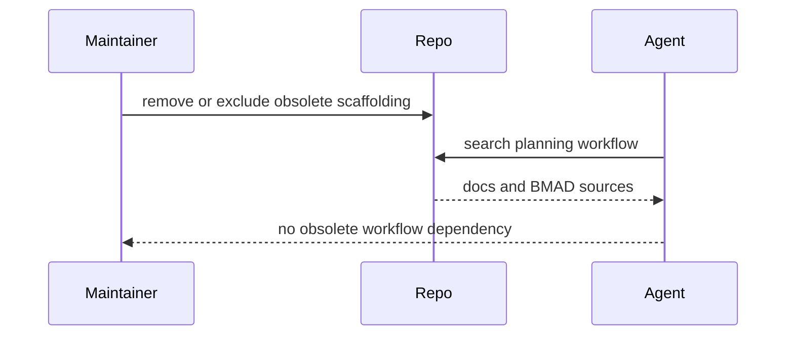

### Story 3.3: Reaffirm MVP Scope Boundaries

**Requirements covered:** FR40, FR41, FR42, FR43, FR44, FR45, FR46

As a product owner,
I want the current release scope to stay narrow,
So that authentication reliability and pack registration are not delayed by future-facing work.

**Acceptance Criteria:**

**Given** future capabilities are documented
**When** current release scope is reviewed
**Then** Nostr account creation, broad onboarding, broader Toolstr developer tools, reusable Angular auth module extraction, installable PWA support, SEO/public discoverability, and polished public wiki delivery remain out of scope
**And** these exclusions are visible in the active planning artifacts.

**Given** future roadmap items remain valuable
**When** scope boundaries are documented
**Then** future wiki, reusable module extraction, onboarding, merge tools, feed, PWA, and SEO work are preserved as future direction where appropriate
**And** they do not block MVP authentication and pack membership work.

**Given** implementation agents pick up stories
**When** they read active planning artifacts
**Then** they can distinguish MVP requirements from growth or future vision
**And** they avoid introducing excluded work without a new decision.

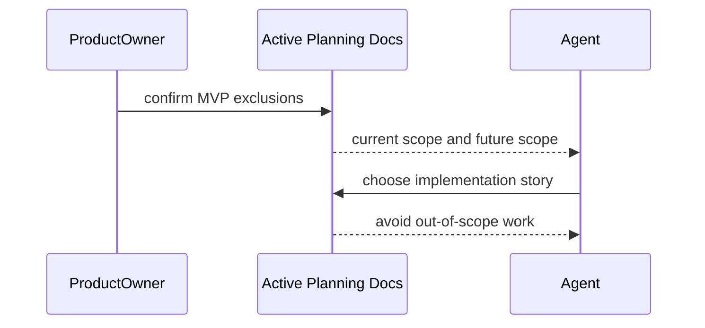

### Story 3.4: Prepare Future Knowledge Base Without Delivering Public Wiki

**Requirements covered:** FR38, FR39, FR46

As a future contributor,
I want preserved project knowledge structured enough to support a later wiki,
So that Nostr auth learnings can be reused without making public documentation part of the MVP.

**Acceptance Criteria:**

**Given** preserved support docs include Nostr auth rules, ADRs, research, incidents, and guides
**When** knowledge preservation is complete
**Then** the material remains findable under the active project documentation structure
**And** it can support future wiki creation.

**Given** the current release excludes polished public documentation
**When** documentation work is planned
**Then** it focuses on internal preservation, source-of-truth clarity, and implementation handoff
**And** it does not add public wiki polish, SEO content, or broad developer-facing docs as MVP deliverables.

**Given** future wiki work becomes desirable
**When** the team resumes that direction after MVP stabilization
**Then** preserved materials provide source inputs
**And** a new planning decision can define public documentation scope.

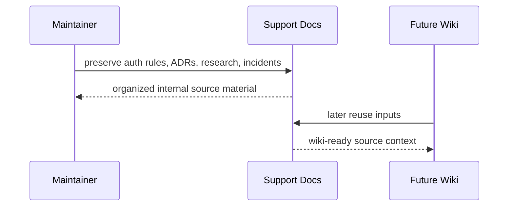
