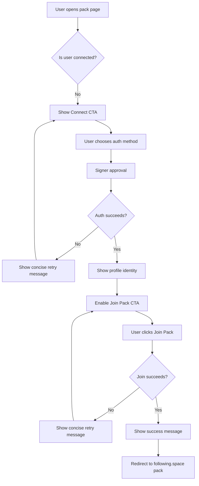
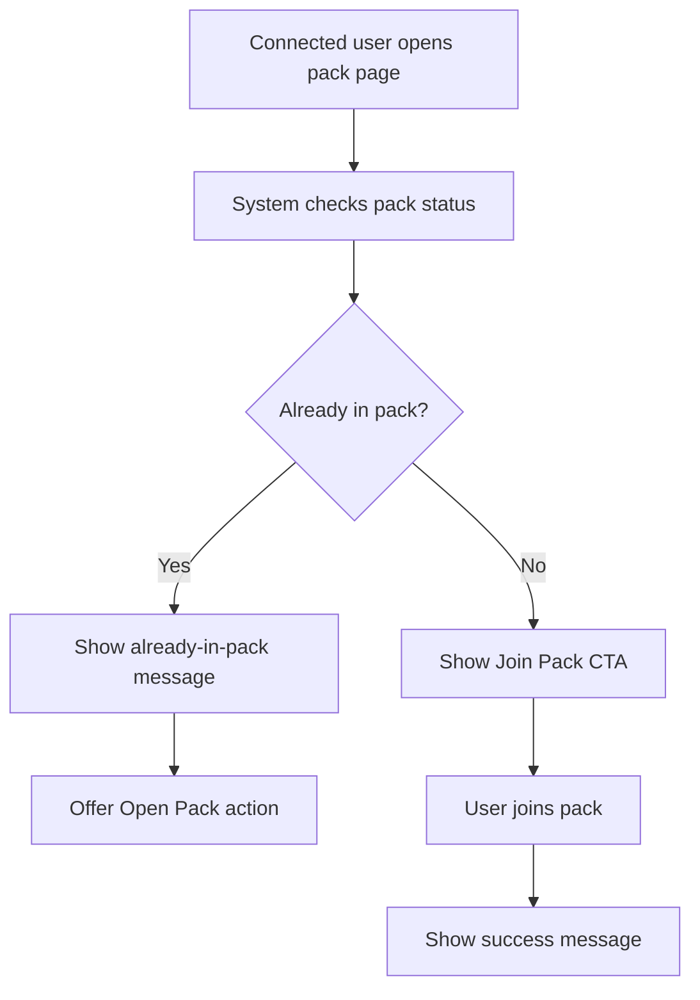
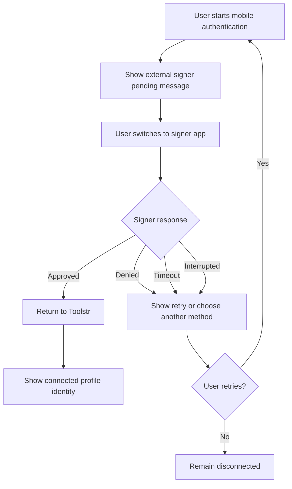
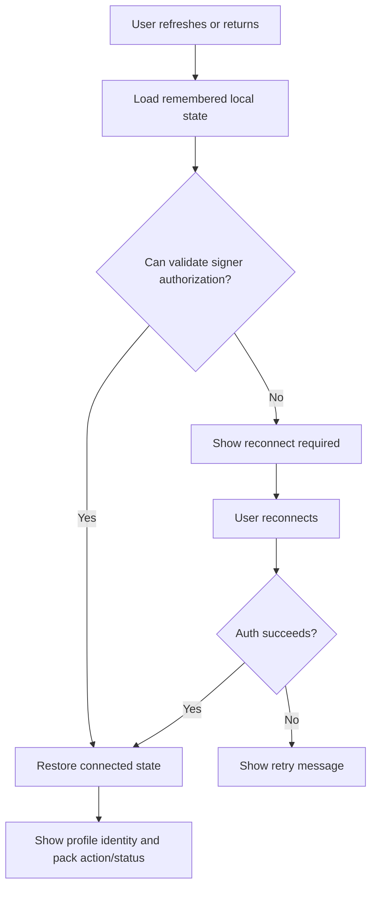

---
stepsCompleted:
  - step-01-init
  - step-02-discovery
  - step-03-core-experience
  - step-04-emotional-response
  - step-05-inspiration
  - step-06-design-system
  - step-07-defining-experience
  - step-08-visual-foundation
  - step-09-design-directions
  - step-10-user-journeys
  - step-11-component-strategy
  - step-12-ux-patterns
  - step-13-responsive-accessibility
  - step-14-complete
lastStep: 14
status: complete
completedAt: 2026-05-01
inputDocuments:
  - _bmad-output/planning-artifacts/prd.md
  - _bmad-output/project-context.md
---

# UX Design Specification nostr-tools-ng-app

**Author:** Maxime
**Date:** 2026-05-01

---

<!-- UX design content will be appended sequentially through collaborative workflow steps -->

## Executive Summary

### Project Vision

`nostr-tools-ng-app` is an existing Nostr web application focused on making authentication reliable, understandable, and low-friction for users who range from new-to-Nostr to familiar Nostr users. The MVP design priority is not feature expansion; it is making bunker, external signer app, and browser extension authentication feel predictable across desktop and mobile.

The UX must help users complete sign-in, preserve valid sessions across refreshes, recover from interrupted signer flows, and register for pack access without needing to understand Nostr protocol details. Authentication should feel boring, durable, and trustworthy while preserving the currently validated visual design.

### Target Users

The primary users are Nostr users who may be new or familiar with Nostr but are not assumed to be technical. They may have a browser extension, external signer app, or bunker setup, but they should not need to understand the underlying signer mechanics to complete the flow.

Users will access the product on both desktop and mobile. Mobile users may switch between the browser and signer apps, while desktop users may rely more on browser extensions or bunker approval flows.

Secondary users are admins who need to verify pack registration activity, identify users added through Toolstr, and remove users from the pack when needed.

### Key Design Challenges

- Make complex Nostr authentication states understandable without exposing protocol complexity.
- Support desktop and mobile signer behavior, including permission prompts, app switching, focus changes, delayed approvals, cancellations, and return-to-app recovery.
- Preserve valid sessions after refresh while avoiding false signed-in states when authorization has expired, been revoked, or is unavailable.
- Keep authentication failure handling minimalistic while still giving users clear recovery actions.
- Preserve the validated current design while improving auth clarity, state messaging, and flow reliability.

### Design Opportunities

- Turn Nostr authentication into a calm, guided flow that feels approachable to non-technical users.
- Use concise status and recovery messages to reduce anxiety during external signer or bunker approval.
- Make pack registration feel immediate and final with clear success and already-in-pack states.
- Create reusable UX patterns for pending, interrupted, expired, and recoverable signer states.
- Maintain trust by making every auth and registration state explicit, fast, and easy to act on.

## Core User Experience

### Defining Experience

The core user experience is simple: the user authenticates, understands they are connected, and joins the pack with minimal effort. In the current MVP, the most frequent action is pressing the button to join the pack, but the defining interaction is reliable authentication because every other action depends on it.

The experience should support users who are new to familiar with Nostr, without requiring technical understanding. Users should understand what the pack is, why they are joining it, and whether they are already in it. Once authenticated, they should see a clear signed-in state, including their profile identity, name, and available pack actions.

The ideal flow is two-click simple: connect, then join the pack. If the user has already granted signer authorization for a valid duration, they should not be repeatedly disconnected or asked to sign again unnecessarily.

### Platform Strategy

The MVP is desktop-first, with mobile compatibility required. Desktop users are expected to commonly authenticate with browser extensions. Mobile users are expected to commonly authenticate through an external signer app such as Amber or Alby, with bunker also supported.

External signer authentication is the preferred mobile pattern because users should not be encouraged to use raw private keys. Private-key-based authentication may remain only as a hidden fallback or backup option if retained at all.

Offline functionality is out of scope for the MVP. A future installable PWA is also out of scope for the current release, though the UX should not prevent that direction later.

### Effortless Interactions

After successful authentication, the user should be returned to the relevant page and shown that they are signed in. Their profile information should be visible, and the pack action should be available immediately.

Joining the pack should require no extra validation step. The previous playful fake captcha introduced unnecessary friction and should not be part of the MVP flow. Once the user requests to join, the system should automatically add them when eligible.

If the user is already in the pack, the app should show a clear message explaining that they are already included and no further action is needed.

The UX should minimize signing prompts. Repeated signing, repeated disconnection, or unnecessary re-authentication after authorization has already been granted would create friction and damage trust.

### Critical Success Moments

The first success moment is: "I am connected." The user should immediately see that authentication worked through visible profile identity and available next actions.

The second success moment is: "I joined the pack." This should happen quickly after the user chooses to join, ideally in a simple two-click flow from authentication to membership.

The make-or-break experience is authentication reliability. If authentication is slow, repeatedly asks for signatures, fails on mobile, loses session state, or disconnects users despite valid signer authorization, the rest of the product experience will feel broken.

Pack registration must also remain clear and fast. Users should not be left waiting indefinitely, asked to complete unnecessary steps, or confused about whether they joined successfully.

### Experience Principles

- Authentication first: reliable signing and session continuity are the foundation of the entire UX.
- Two-click confidence: users should be able to connect and join the pack with minimal steps.
- Show connection clearly: authenticated users should immediately see their profile identity and available actions.
- Prefer safe signer patterns: desktop should favor extensions, mobile should favor external signer apps, and raw private key use should be hidden or treated as fallback only if retained.
- No unnecessary friction: remove fake captcha, repeated signing, avoidable re-authentication, and unclear waiting states.
- Minimal recovery: failure states should stay concise and action-oriented, with retry or choose-another-method options rather than heavy diagnostics.

## Desired Emotional Response

### Primary Emotional Goals

The primary emotional goal is relief. Users should feel that Toolstr removes the friction of finding relevant people to follow on Nostr, especially in the French-speaking community context. Joining the pack should create the feeling of: "Finally, I have a simple way to find people and content."

The second emotional goal is confidence. Users should feel that authentication works cleanly, without bugs, unnecessary retries, repeated signing, or unclear states. Because Nostr authentication can often feel fragile, a smooth sign-in flow should make users think: "This is simple, well made, and it works."

The third emotional goal is belonging. Even if users are not literally joining a social community inside the app, they are gaining access to a curated set of people and content. The UX should make joining the pack feel like gaining access to a relevant network rather than completing a technical operation.

### Emotional Journey Mapping

When users first arrive, they should feel that the interface is attractive, clear, and immediately understandable. They should know where to go and what to do without needing technical explanation.

During authentication, users should feel guided and reassured. The app should avoid creating anxiety through repeated prompts, unclear waiting states, or technical language.

After successful connection, users should feel happy and reassured that the product is professional, solid, and reliable. Visible profile information and clear next actions should confirm that the connection worked.

After pack registration succeeds, users should feel satisfied and excited to discover new people and content. The success state should reinforce that they now have access to useful contacts to follow.

If something goes wrong, users should feel informed rather than confused. The product should show a concise message and a clear action, such as retrying or choosing another authentication method.

When returning, users should feel continuity. If they already granted permission to stay signed in, they should not need to sign again unnecessarily. Session restoration should feel invisible and dependable.

### Micro-Emotions

The most important micro-emotions are:

- Belonging over isolation: users should feel connected to a relevant Nostr network.
- Trust over confusion: users should understand whether they are connected, pending, already in the pack, or need to act.
- Efficiency over friction: the flow should avoid repeated signing, unnecessary validation, and unclear waiting.
- Confidence over skepticism: the app should feel like a real, reliable product rather than an experiment.
- Relief over anxiety: users should feel that Toolstr solved a difficult Nostr onboarding/discovery problem for them.

### Design Implications

To create relief, the UX should make the value of the pack clear: it helps users find people and content to follow.

To create confidence, the app should show visible signed-in identity, clear next steps, and stable session continuity.

To create belonging, the pack join experience should feel like access to a useful French-speaking Nostr network, not just a backend registration event.

To create trust, authentication states must be explicit but minimal: connected, pending, success, already in pack, error, retry.

To create efficiency, the app should remove fake validation, avoid repeated signing, and restore valid sessions without asking the user to repeat work.

### Emotional Design Principles

- Lead with relief: make the pack feel like the simple answer to finding people and content on Nostr.
- Make connection visible: users should immediately see that they are signed in and know what to do next.
- Keep recovery minimal: when something fails, provide one clear message and one clear next action.
- Preserve continuity: returning users should not be asked to sign again when valid permission already exists.
- Feel like a real product: the validated design should communicate polish, reliability, and professional execution.
- Reinforce belonging: successful pack registration should make users feel connected to a relevant community.

## UX Pattern Analysis & Inspiration

### Inspiring Products Analysis

Toolstr does not have a direct equivalent in the current Nostr ecosystem. The closest emerging products do not fully match the intended experience: a simple, automated, trustworthy way to join a curated Nostr pack and discover relevant people to follow.

Primal, Twitter/X, and Nostria are useful references because target users are likely familiar with social products that provide clean interfaces, immediate social value, and repeated engagement through discovery, interaction, and small satisfaction loops. These products show that users return when they find people, content, and social feedback that feel relevant.

Primal and Nostria are especially relevant Nostr references because they make Nostr more approachable than many protocol-heavy clients. However, they also show a common Nostr challenge: relay latency and distributed infrastructure can make loading, failure, and blocked states hard to explain clearly.

Todoist and Fully are strong references for onboarding, clarity, error handling, and success-state design. Their value is not visual similarity, but the way they make flows feel intentional, polished, and trustworthy. They communicate progress, completion, and blocked states without overwhelming the user.

### Transferable UX Patterns

Toolstr should adopt a clean, focused interface pattern: one primary goal, one obvious next action, and minimal competing UI. Like Todoist and Fully, the product should make the user feel guided without feeling hand-held.

The authentication experience should borrow from trustworthy onboarding patterns: clear language, explicit state, no ambiguity about what is happening, and visible confirmation when the user is connected.

The pack join experience should borrow from strong completion patterns: once the user joins, the product should clearly communicate success and reinforce the value gained, such as access to people and content to discover.

Toolstr should also borrow the social discovery promise from Primal, Twitter/X, and Nostria: the emotional reward is not merely registration, but the feeling that the user now has relevant people to follow and content to explore.

Trust-building patterns should include clear terms, transparent free access, and polished interface quality. The app should make it obvious that joining the pack is completely free, and should avoid any ambiguity about payment, cost, or hidden commitment.

### Anti-Patterns to Avoid

Toolstr must avoid common Nostr app failure patterns: buggy flows, half-implemented features, unclear loading states, failed actions, and technical explanations that expose relay or protocol complexity to the user.

The app should avoid foregrounding advanced connection concepts too early. Users should not feel they need to understand relays, signing protocols, or advanced connection methods to complete the MVP flow.

The app should avoid ambiguous waiting states. If something is loading, pending, blocked, failed, or waiting for signer approval, the state should be concise and clear.

The app should avoid feeling like a quickly generated or amateur interface. Trust depends on polish, legal/usage clarity, stable behavior, and a visible sense that the product has been intentionally designed.

The previous fake captcha pattern should remain removed because it adds unnecessary friction to the join flow.

### Design Inspiration Strategy

Toolstr should adopt the focus and clarity of Todoist/Fully-style onboarding: simple steps, strong feedback, and no unnecessary complexity.

Toolstr should adapt social-product patterns from Primal, Twitter/X, and Nostria by emphasizing discovery and belonging, but without building a feed experience into the MVP.

Toolstr should make authentication feel like a polished onboarding step rather than a technical protocol negotiation. The UI should guide users toward the safest and most relevant method: browser extension on desktop, external signer on mobile, and bunker where appropriate.

Toolstr should preserve the validated request/join pattern where it already works well, while revisiting the authentication presentation and method selection to reduce friction and avoid overly technical choices.

The design strategy is to feel clean, professional, trustworthy, free, and focused: users connect, understand they are connected, join the pack, and feel relief that they now have people and content to discover.

## Design System Foundation

### 1.1 Design System Choice

Toolstr will continue using the current themeable Tailwind CSS and DaisyUI foundation. This preserves the existing validated visual design while supporting focused UX improvements for authentication, session state, and pack registration.

The UX specification should not introduce a new design system or major visual redesign for the MVP. The priority is to make the existing interface more reliable, clear, and trustworthy.

### Rationale for Selection

The current visual direction has already been validated, so replacing it would add unnecessary scope and risk. Tailwind CSS and DaisyUI provide enough flexibility to preserve the existing style while creating clearer patterns for the authentication and pack join flows.

This choice supports fast MVP delivery, consistency with the existing Angular implementation, and future extensibility without forcing a custom component library or external design system migration.

The product's differentiation should come from trustworthy Nostr authentication, clear state communication, and a polished joining experience, not from a radically new UI foundation.

### Implementation Approach

The implementation should preserve the existing Tailwind/DaisyUI setup and current visual style. Changes should focus on UX behavior and interaction clarity rather than broad restyling.

Custom components are appropriate where the current system needs product-specific clarity, especially for:

- Authentication method selection.
- Signed-in identity display.
- Pending signer approval states.
- Session restoration states.
- Pack join, success, already-in-pack, and error states.

These components should remain visually consistent with the existing validated design.

### Customization Strategy

The UX spec should stay at the experience and interaction-pattern level for now. It should not define detailed design tokens, component APIs, or low-level visual implementation rules.

Visual implementation details should remain in the app, using the existing Tailwind/DaisyUI foundation and project conventions. The spec should instead define the required UX states, interaction expectations, hierarchy, and user-facing clarity needed for authentication and pack registration.

## 2. Core User Experience

### 2.1 Defining Experience

The defining experience is: "I finally found French-speaking Nostr accounts to follow, and joining the pack was simple."

The deeper long-term magic is discovery: users feel less lost in Nostr because they find French-speaking accounts, content, and people to interact with. For the urgent MVP, the immediate defining interaction is pack joining. The user connects, joins the pack, receives confirmation, and is redirected to the pack on `following.space`.

The MVP does not need to deliver the full discovery experience inside Toolstr yet. It only needs to make access reliable and fast so manual pack admission is no longer required. Once authentication and pack joining are stable, richer discovery features can follow.

### 2.2 User Mental Model

Users currently struggle to find French-speaking accounts on Nostr. Many users do not naturally discover these accounts or know where to start. Toolstr should address that feeling of being lost by presenting the pack as a simple way to find relevant French-speaking accounts to follow.

The term "pack" can be misunderstood. Some users may think it means joining a group or community, while the current pack is primarily a set of accounts to follow. Being part of the pack also helps users be discovered by others, but the MVP should avoid overpromising community functionality that is not yet present.

Users may expect the pack to lead to interactions with other people, and this expectation is directionally aligned with the future roadmap. Future Toolstr features may include a chat between pack members, a feed from pack users, trust score concepts, list merging tools, and ways to merge or copy users from other packs.

Toolstr's long-term position should remain open and non-exclusive. The product can promote other French-speaking Nostr solutions and let users choose the best content or pack for their needs.

### 2.3 Success Criteria

The urgent MVP success criteria are:

- The user can connect and join the pack in under 10 seconds under normal conditions, excluding required signer approval clicks.
- The flow should feel like two primary app clicks: connect, then join the pack.
- The user clearly sees when they are connected.
- The user clearly sees when they have joined the pack.
- The user receives a concise success message.
- The user is redirected to the pack on `following.space` after successful joining.
- The user is not asked to complete unnecessary validation or fake captcha steps.
- The user is not repeatedly disconnected or asked to sign again when valid permission already exists.

Future success states may include suggested people to follow, suggested content, or playful celebratory details such as Bitcoin-themed visual rewards. These are not MVP priorities.

### 2.4 Novel UX Patterns

The MVP should use established patterns rather than novel interaction design. Users should see familiar actions: connect, confirm identity, join, success, redirect.

The novel part is not the interaction itself, but the context: making Nostr pack joining automatic, free, fast, and reliable for French-speaking account discovery. This should be explained with simple language rather than new UI metaphors.

Toolstr should avoid presenting the pack as a full community unless community functionality exists. It can communicate that the pack helps users discover and be discovered by French-speaking Nostr users.

### 2.5 Experience Mechanics

The core action starts on the pack page.

If the user is not connected, the primary available action is to connect. The join button should not be available as an active action until the user is authenticated. It may appear disabled or direct the user to connect first, matching the current validated flow.

After authentication succeeds, the user sees their profile identity and the primary CTA becomes "join the pack." If the user is already in the pack, the app shows a clear already-in-pack message.

When the authenticated user chooses to join, the system automatically processes the request without fake captcha or extra validation. On success, the app shows a concise confirmation message and redirects the user to the pack on `following.space`.

After completion, no further action is required inside Toolstr. The user can continue independently, and future iterations may add richer next steps such as suggested follows, pack feed, chat, trust score, or merge-pack tools.

## Visual Design Foundation

### Color System

Toolstr will use the existing DaisyUI `brutal` theme as the locked MVP visual foundation. No new color palette should be introduced for the MVP.

The current theme uses a light brutalist style with OKLCH colors, high-contrast content colors, square corners, thick borders, no depth, and no noise. This supports the existing validated interface and should remain stable while the MVP focuses on Nostr authentication and pack-joining reliability.

The existing semantic DaisyUI mappings should be used for product states:

- Primary: main calls to action such as connect and join.
- Secondary: supporting emphasis or contextual UI.
- Success: successful authentication, successful pack joining, and already-valid states.
- Warning: pending signer approval, waiting states, or recoverable interruptions.
- Error: failed authentication, failed pack joining, expired authorization, or unavailable signer states.
- Info: neutral guidance and explanatory state messaging.

### Typography System

Typography should remain aligned with the existing app. The UX specification should not introduce new font choices, type scales, or typography redesign work for the MVP.

The required typography behavior is functional: headings must make the primary action clear, body text must stay concise, and state messages must be readable and understandable for non-technical users.

### Spacing & Layout Foundation

Spacing and layout should remain consistent with the current validated UI. The MVP should not spend effort on broad layout redesign.

The pack page should stay focused around the current primary flow: connect, confirm identity, join the pack, receive success or already-in-pack feedback, and redirect when appropriate.

Any layout changes should be limited to improving state clarity for Nostr authentication, session restoration, signer approval, and pack registration.

### Accessibility Considerations

The existing visual foundation must continue to meet WCAG AA expectations. Authentication and pack registration states must be perceivable, keyboard-operable, and understandable without relying only on color.

Because the MVP priority is Nostr reliability, accessibility work should focus on the core flow: visible focus states, clear button labels, readable status messages, and concise error/recovery text.

## Design Direction Decision

### Design Directions Explored

A constrained design-direction showcase was created at `_bmad-output/planning-artifacts/ux-design-directions.html`.

Because the MVP visual UI is locked, this step did not explore broad visual redesign directions. Instead, the exploration compared state and flow patterns within the existing DaisyUI `brutal` theme and validated Toolstr interface.

The explored directions were:

- Current validated flow: preserve the current page structure and clarify state labels only.
- Identity-first flow: make visible profile identity the main proof that authentication worked.
- Minimal pending state: show one concise signer approval message without protocol detail.
- Success + redirect: confirm pack membership, then redirect to the pack on `following.space`.
- Already-in-pack state: show idempotent membership clearly and calmly.
- Minimal recovery state: provide one concise failure message and one next action.

### Chosen Direction

The chosen direction is to preserve the current validated visual design and focus design work only on Nostr-related UX reliability states.

The product should keep the existing page and component style while improving the authentication, session restoration, signer approval, pack joining, already-in-pack, success, redirect, and recovery states.

### Design Rationale

The MVP priority is fixing Nostr-related bugs and reliability issues, not redesigning the interface. Broad visual exploration would add scope and distract from the urgent need to make authentication and pack joining work reliably.

The locked visual direction preserves validation already achieved while still allowing targeted UX improvements where users currently experience friction: mobile authentication, repeated signing, unclear connection state, and pack joining feedback.

This approach supports the emotional goals of confidence, relief, belonging, and trust without increasing implementation risk.

### Implementation Approach

Implementation should avoid broad visual changes. Work should be limited to state clarity and flow reliability:

- Preserve the existing DaisyUI `brutal` theme and current layout.
- Keep the current connect-first, join-second flow.
- Make signed-in identity visible after authentication.
- Keep signer pending and error messages concise.
- Remove unnecessary validation such as fake captcha.
- Show clear success and already-in-pack states.
- Redirect to `following.space` after successful joining when appropriate.
- Treat richer discovery, animations, suggested follows, and celebratory visuals as post-MVP.

## User Journey Flows

### Connect and Join Pack

The primary MVP journey starts on the pack page. The user is not yet connected, so the app presents connection as the required first action. The join action is unavailable until authentication succeeds.

After the user connects, the app shows visible profile identity and changes the primary action to joining the pack. When the user joins successfully, the app displays a concise success message and redirects to the pack on `following.space`.

### Already In Pack

If the user is already a pack member, the app should avoid presenting this as an error. The user should receive calm confirmation that they are already included and can open the pack.

### External Signer / Mobile Pending Flow

Mobile users are expected to use external signer apps. The app should present a minimal pending state while the user switches to the signer and approves the request. If approval is delayed, denied, cancelled, or interrupted, the app should return to one clear recovery action.

### Session Restore On Return

Returning users should not need to sign again when valid permission already exists. If the app cannot validate signer authorization, it should not silently treat the user as authenticated; it should ask for reconnection with minimal explanation.

### Journey Patterns

- Connect before join: users must authenticate before pack joining becomes active.
- Identity confirms auth: visible profile identity is the main proof that connection worked.
- One primary action: each state should expose one obvious next action.
- Minimal pending state: signer approval should use concise instructions and no protocol detail.
- Idempotent membership: already-in-pack is a success-like state, not an error.
- Recovery over diagnosis: failures should provide retry or choose-another-method actions.

### Flow Optimization Principles

- Keep the main path to two app clicks where possible: connect, then join.
- Avoid fake validation, extra confirmation steps, and repeated signing.
- Make mobile signer transitions resilient to app switching and delayed approvals.
- Restore valid sessions silently and visibly confirm connection.
- Never show ambiguous loading states without a clear pending reason or next action.
- Redirect after successful joining rather than requiring more in-app decisions.

## Component Strategy

### Design System Components

The existing Tailwind CSS and DaisyUI foundation should remain the basis for MVP UI. Existing design system primitives should be used wherever possible:

- Buttons and disabled buttons.
- Cards and content sections.
- Alerts and status messages.
- Form fields.
- Tabs, grouped actions, cards, or buttons for authentication method selection.
- Badges and labels.
- Loading indicators.
- Basic responsive layout primitives.

The UX specification should not require a broad component library expansion. Component work should support the urgent MVP priority: fixing Nostr-related authentication, session, and pack-joining reliability.

### Custom Components

#### Auth Method Selector

**Purpose:** Help users choose an authentication method without needing to understand Nostr protocol details.

**Usage:** Used when a disconnected user starts the connect flow.

**Anatomy:** Method options, short plain-language descriptions, recommended method cues by platform, and access to advanced options.

**States:** Default, selected, unavailable, pending, error, disabled.

**Variants:** Authentication on Nostr is commonly presented as tabs, and Toolstr can consider tabs, grouped buttons, cards, or the current modal pattern. The existing modal should remain acceptable for MVP because it was chosen to keep authentication simple.

**Private Key Handling:** Private-key login should not be part of the default visible selector. If retained, it should be hidden behind an explicit two-step advanced/reveal interaction so users are not encouraged to use raw private keys.

**Accessibility:** Options must be keyboard-operable, clearly labeled, and expose selected/unavailable states accessibly.

**Content Guidelines:** Use user-facing labels such as browser extension, mobile signer app, and bunker. Avoid exposing protocol-heavy terminology unless needed for advanced users.

#### Signed-In Identity Summary

**Purpose:** Confirm that authentication worked and show the user who they are connected as.

**Usage:** Display after successful authentication and during restored sessions.

**Anatomy:** Profile image or fallback, display name, identifier if needed, connected status, and optional sign-out access.

**States:** Connected, restored, loading profile, profile unavailable.

**Accessibility:** The connected identity should be readable by assistive technology and not rely only on avatar imagery.

**Content Guidelines:** Keep this concise. The goal is reassurance, not a full profile card.

#### Signer Pending Status

**Purpose:** Help users understand that Toolstr is waiting for signer approval.

**Usage:** Used after the user starts external signer, bunker, or browser extension authentication and approval is pending.

**Anatomy:** Concise status message, optional spinner/loading indicator, cancel action, and retry path if needed.

**States:** Waiting for extension approval, waiting for mobile signer app, waiting for bunker approval, delayed, cancelled, denied, timed out.

**Accessibility:** Pending states should be announced where appropriate and must not rely only on motion or color.

**Content Guidelines:** Keep copy minimal and action-oriented. Example: "Approve the connection in your signer app."

#### Session Restore Status

**Purpose:** Communicate refresh/return behavior without creating false signed-in confidence.

**Usage:** Used when the app loads remembered state and checks whether signer authorization is still valid.

**Anatomy:** Restoring state, restored confirmation if needed, reconnect required state.

**States:** Restoring, restored, expired, revoked/unavailable, reconnect required.

**Accessibility:** State changes should be perceivable and not trap focus.

**Content Guidelines:** Prefer silent restoration when successful. Only interrupt the user when reconnection is required.

#### Pack Join Status

**Purpose:** Communicate pack membership and registration progress clearly.

**Usage:** Used on the pack page after authentication and during pack registration.

**Anatomy:** Join CTA, joining state, success state, already-in-pack state, retry/recovery state, optional open-pack or redirect message.

**States:** Not connected, can join, joining, joined, already in pack, failed, retry available, redirecting.

**Accessibility:** Button state and status text must be clear for keyboard and screen-reader users.

**Content Guidelines:** Already-in-pack should feel like success, not an error. Success should be concise and may mention redirection to `following.space`.

#### Minimal Recovery Message

**Purpose:** Standardize user-facing recovery from failed authentication or pack actions.

**Usage:** Used when auth, session restoration, signer approval, or pack joining fails.

**Anatomy:** Short message, one primary action, optional secondary action.

**States:** Retry authentication, choose another method, reconnect, retry pack joining, open pack.

**Accessibility:** Recovery actions must be reachable by keyboard and described with explicit labels.

**Content Guidelines:** Avoid heavy diagnostics by default. Give users the next useful action.

### Component Implementation Strategy

The UX spec defines required UX patterns, not the final Angular component architecture. Whether signer pending, session restoration, and recovery messages are implemented as separate components or one generic status-message component should be decided during technical implementation.

Implementation should preserve the current visual design and use existing Tailwind/DaisyUI primitives. Custom component work should be introduced only where it improves Nostr auth reliability, state clarity, or pack-joining feedback.

### Implementation Roadmap

**Phase 1 - Urgent MVP Nostr Reliability Components**

- Auth Method Selector.
- Signed-In Identity Summary.
- Signer Pending Status.
- Session Restore Status.
- Pack Join Status.
- Minimal Recovery Message.

**Phase 2 - Post-MVP Discovery Enhancements**

- Suggested people to follow.
- Suggested content after joining.
- Pack feed entry points.
- Pack member chat entry points.
- Trust score or pack relationship indicators.
- Merge-pack/list management patterns.

**Phase 3 - Future Delight and Growth**

- Richer success celebration.
- Bitcoin-themed visual reward details.
- Installable PWA-specific UI patterns.
- Broader onboarding for creating keys, installing extensions, and understanding Nostr.

## UX Consistency Patterns

### Button Hierarchy

The MVP should use one primary action per state whenever possible.

Primary actions should be reserved for the next required step in the core flow:

- Connect.
- Join pack.
- Retry connection.
- Reconnect.
- Open pack.

Secondary actions should support escape or alternatives:

- Cancel.
- Choose another method.
- Reveal advanced options.
- Sign out.

Disabled actions should explain what is required before they become available. For example, the join action can be unavailable until the user is connected.

Buttons should preserve the existing DaisyUI brutal visual style and must remain keyboard-operable with visible focus states.

### Feedback Patterns

Feedback should be concise, state-specific, and action-oriented. The user should always understand whether they are connected, waiting, successful, already included, or need to act.

Core feedback states:

- Connected: show visible profile identity.
- Pending signer approval: explain what the user needs to approve.
- Restoring session: avoid interrupting unless reconnection is required.
- Success: confirm pack joining and redirect when appropriate.
- Already in pack: present as a success-like state, not an error.
- Expired/revoked/unavailable authorization: ask the user to reconnect.
- Failure: provide one clear recovery action.

Feedback should avoid protocol-heavy explanations by default. Technical detail belongs only in advanced/debug contexts, not the MVP user flow.

### Form Patterns

Forms should be minimal and only appear when required by the selected authentication method.

Bunker token input and advanced/private-key fallback input should use clear labels, concise helper text, and explicit validation messages. Private-key login, if retained, must be hidden behind a two-step advanced/reveal interaction.

Form validation should happen early enough to prevent avoidable failed attempts, especially for malformed bunker tokens or missing required values.

No form should ask for more information than needed to complete authentication.

### Navigation Patterns

The MVP flow should be page-led and action-focused:

- User starts on the pack page.
- Disconnected users are guided to connect.
- Connected users are guided to join.
- Successful users receive confirmation and are redirected to `following.space`.
- Already-in-pack users can open the pack without treating their state as an error.

The app should avoid adding intermediate navigation steps after pack joining. Post-MVP discovery, onboarding, feed, chat, or suggested follows can introduce richer navigation later.

### Additional Patterns

#### Auth Modal Pattern

The current auth modal remains valid for MVP. It should prioritize simple choices and avoid overwhelming users with advanced connection concepts.

Desktop should favor browser extension authentication. Mobile should favor external signer app authentication. Bunker should remain available where appropriate. Private-key login should be hidden or advanced-only if retained.

#### Loading And Pending Pattern

Pending states should always name the thing being waited on:

- Waiting for signer app approval.
- Waiting for browser extension approval.
- Waiting for bunker approval.
- Joining pack.
- Redirecting to the pack.

Avoid generic indefinite loading. If a wait can fail or time out, provide a recovery path.

#### Recovery Pattern

Recovery should stay minimalistic:

- One concise message.
- One primary next action.
- Optional secondary action only when useful.

Examples:

- "Connection expired. Reconnect."
- "Approval was cancelled. Try again."
- "Could not join the pack. Retry."
- "Signer unavailable. Choose another method."

#### Advanced Options Pattern

Advanced options should be hidden by default and revealed intentionally. This applies especially to private-key login or technical connection options.

The reveal interaction should make risk or complexity clear without using alarmist language.

## Responsive Design & Accessibility

### Responsive Strategy

The MVP is desktop-first with required mobile compatibility. The current validated layout should remain in place, with changes limited to state clarity and reliability for authentication, session restoration, signer approval, and pack joining.

Desktop should prioritize browser-extension authentication and a clear connect-first, join-second flow.

Mobile should prioritize external signer flows. The most important mobile UX requirement is reliable app switching and return-to-Toolstr behavior after signer approval, denial, timeout, or interruption.

Tablet does not require a dedicated UX strategy for MVP. It can follow the existing responsive behavior unless a specific signer flow exposes a usability issue.

The auth modal can remain the default pattern for MVP. If mobile usability requires it, implementation may adapt the modal into a more full-screen dialog-like experience, but this should be treated as a pragmatic usability adjustment rather than a redesign.

### Breakpoint Strategy

The MVP should continue using the app's existing responsive behavior and Tailwind/DaisyUI conventions. No custom breakpoint strategy is required for this release.

Responsive work should be validated against the core flows:

- Connect.
- Approve via signer.
- Return to Toolstr.
- See connected identity.
- Join pack.
- See success or already-in-pack feedback.
- Redirect to `following.space`.

### Accessibility Strategy

Formal WCAG or RGAA certification is not an MVP scope item. The MVP priority is Nostr authentication and pack-joining reliability.

However, the core flow should still avoid obvious accessibility failures. Interactive controls should remain keyboard-operable, labels should be clear, focus states should remain visible, and status messages should be perceivable without relying only on color.

Pending signer states and success/failure state changes should be understandable to users, but the MVP should not add a broad accessibility program beyond the core auth and pack flow.

### Testing Strategy

MVP responsive testing should focus on real devices and real signer behavior rather than abstract viewport testing only.

The test matrix should include popular iOS and Android signer flows used by the target audience, plus common desktop browser extensions. The project does not need to support every Nostr signer for MVP, but it should identify and validate the signers/extensions most likely to be used by French-speaking Nostr users.

The MVP validation matrix should include:

- Desktop browser extension authentication.
- Mobile external signer authentication.
- Bunker authentication.
- Page refresh after successful authentication.
- Return-to-app behavior after mobile signer approval.
- Denied, cancelled, expired, unavailable, and timeout states.
- Pack joining after authentication.
- Already-in-pack resolution.
- Redirect to `following.space` after success.

The exact list of supported/tested signers and extensions should be finalized during implementation or QA planning. The UX requirement is graceful handling when a signer is unavailable or approval does not complete.

### Implementation Guidelines

Implementation should preserve the current validated UI and focus on reliability.

Responsive implementation should ensure mobile signer flows survive app switching, browser focus changes, and return-to-app transitions. Session restoration should avoid unnecessary re-signing when valid permission exists.

User-facing state messages should stay concise and action-oriented. The UI should not expose relay or protocol complexity unless a future advanced/debug mode is intentionally added.
