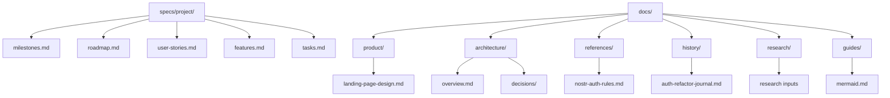

# Documentation Index

Updated: 2026-04-26

This directory contains supporting documentation only. Active project management, milestones,
roadmap, user stories, features, and task status live in [../specs/project/](../specs/project/).

## Find the Right Source

| Need                           | Destination                                                            |
| ------------------------------ | ---------------------------------------------------------------------- |
| Active project source of truth | [../specs/project/README.md](../specs/project/README.md)               |
| Milestones                     | [../specs/project/milestones.md](../specs/project/milestones.md)       |
| Roadmap                        | [../specs/project/roadmap.md](../specs/project/roadmap.md)             |
| Tasks and handoff briefs       | [../specs/project/tasks.md](../specs/project/tasks.md)                 |
| User stories                   | [../specs/project/user-stories.md](../specs/project/user-stories.md)   |
| Feature registry               | [../specs/project/features.md](../specs/project/features.md)           |
| Architecture decisions         | [architecture/decisions/README.md](architecture/decisions/README.md)   |
| Stable rules and constraints   | [references/nostr-auth-rules.md](references/nostr-auth-rules.md)       |
| History/archive context        | [history/auth-refactor-journal.md](history/auth-refactor-journal.md)   |
| Research input                 | [research/nostr-auth-ux-pattern.md](research/nostr-auth-ux-pattern.md) |
| Product design reference       | [product/landing-page-design.md](product/landing-page-design.md)       |
| Repository guides              | [guides/mermaid.md](guides/mermaid.md)                                 |

## Role Taxonomy

| Role                     | Primary Location               | Purpose                                                                         |
| ------------------------ | ------------------------------ | ------------------------------------------------------------------------------- |
| Project Source Of Truth  | `specs/project/`               | Active milestones, roadmap, user stories, features, tasks, and planning archive |
| Architecture Decision    | `docs/architecture/decisions/` | Accepted structural decisions and consequences                                  |
| Architecture Reference   | `docs/architecture/`           | Current architecture overview and implementation context                        |
| Stable Reference         | `docs/references/`             | Durable rules and constraints                                                   |
| Research Input           | `docs/research/`               | Non-normative exploration and inspiration                                       |
| History or Archive       | `docs/history/`                | Historical or superseded context                                                |
| Product Design Reference | `docs/product/`                | Supporting product/design material that does not own roadmap or task state      |
| Guide                    | `docs/guides/`                 | How to read, maintain, or contribute to docs                                    |

## Source-of-Truth Rules

- `specs/project/` owns active project management.
- `docs/` must not contain active task boards, active roadmap state, or canonical user stories.
- If a supporting doc conflicts with `specs/project/`, `specs/project/` wins.
- Research stays non-normative until promoted into `specs/project/`, a stable reference, or an ADR.
- Architecture decisions stay in `docs/architecture/decisions/` and are linked from `specs/project/references.md`.

## Structure

## Code-Adjacent Documentation

Technical workflow documentation closest to implementation remains in `src/`.

Useful entry points:

- [../src/README.md](../src/README.md)
- [../src/core/README.md](../src/core/README.md)
- [../src/core/nostr/README.md](../src/core/nostr/README.md)
- [../src/core/nostr-connection/README.md](../src/core/nostr-connection/README.md)
- [../src/core/zap/README.md](../src/core/zap/README.md)
- [../src/features/packs/README.md](../src/features/packs/README.md)
