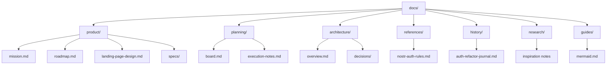

# Documentation Index

Updated: 2026-04-26

Cette documentation est organisee par role documentaire.

Le but :

- simple a lire pour un humain
- simple a maintenir pour un agent
- claire sur la source de verite active
- sans dossier fourre-tout

## Lire quoi selon le besoin

| Besoin                                   | Document                                                               |
| ---------------------------------------- | ---------------------------------------------------------------------- |
| Comprendre le produit                    | [product/mission.md](product/mission.md)                               |
| Voir la direction produit                | [product/roadmap.md](product/roadmap.md)                               |
| Comprendre la direction artistique LP    | [product/landing-page-design.md](product/landing-page-design.md)       |
| Comprendre l'architecture du repo        | [architecture/overview.md](architecture/overview.md)                   |
| Lire les decisions structurantes         | [architecture/decisions/README.md](architecture/decisions/README.md)   |
| Lire les contraintes auth stables        | [references/nostr-auth-rules.md](references/nostr-auth-rules.md)       |
| Voir le travail actif                    | [planning/board.md](planning/board.md)                                 |
| Demarrer une session agent sur une tache | [planning/execution-notes.md](planning/execution-notes.md)             |
| Affiner une spec produit                 | [product/specs/auth-mobile-web.md](product/specs/auth-mobile-web.md)   |
| Comprendre un chantier passe             | [history/auth-refactor-journal.md](history/auth-refactor-journal.md)   |
| Consulter de la recherche / inspiration  | [research/nostr-auth-ux-pattern.md](research/nostr-auth-ux-pattern.md) |
| Lire le guide Mermaid                    | [guides/mermaid.md](guides/mermaid.md)                                 |

## Arborescence

## Conventions de maintenance

- `planning/board.md` est la source de verite active pour l'execution.
- `product/roadmap.md` porte la direction produit, pas le detail du board.
- `product/specs/` contient uniquement des specs ciblees.
- `references/` contient des contraintes stables, pas des todos.
- `history/` garde la memoire, mais n'est jamais la todo active.
- `research/` contient des inputs non normatifs.
- Si un document historique contredit le board actif, le board actif gagne.

## Documentation proche du code

La documentation de workflow technique la plus proche du code reste dans `src/`.

Entrees utiles :

- [../src/README.md](../src/README.md)
- [../src/core/README.md](../src/core/README.md)
- [../src/core/nostr/README.md](../src/core/nostr/README.md)
- [../src/core/nostr-connection/README.md](../src/core/nostr-connection/README.md)
- [../src/core/zap/README.md](../src/core/zap/README.md)
- [../src/features/packs/README.md](../src/features/packs/README.md)
