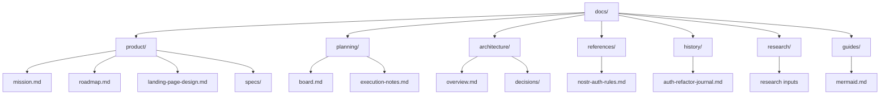

# Documentation Index

Updated: 2026-04-26

This repository documentation is organized by role. The goal is quick navigation, clear authority, and stable maintenance conventions.

## Find the Right Source

| Need                                      | Authoritative Destination                                              |
| ----------------------------------------- | ---------------------------------------------------------------------- |
| Understand product mission                | [product/mission.md](product/mission.md)                               |
| Follow product direction and sequencing   | [product/roadmap.md](product/roadmap.md)                               |
| Review active execution status            | [planning/board.md](planning/board.md)                                 |
| Start a task handoff brief (board-backed) | [planning/execution-notes.md](planning/execution-notes.md)             |
| Read architecture decisions               | [architecture/decisions/README.md](architecture/decisions/README.md)   |
| Read stable rules and constraints         | [references/nostr-auth-rules.md](references/nostr-auth-rules.md)       |
| Read product-facing focused specs         | [product/specs/auth-mobile-web.md](product/specs/auth-mobile-web.md)   |
| Read Spec Kit feature artifacts           | [../specs/](../specs/)                                                 |
| Read history/archive context              | [history/auth-refactor-journal.md](history/auth-refactor-journal.md)   |
| Read research input                       | [research/nostr-auth-ux-pattern.md](research/nostr-auth-ux-pattern.md) |
| Read repository guides                    | [guides/mermaid.md](guides/mermaid.md)                                 |

## Role Taxonomy

| Role                  | Primary Location                                      | Purpose                                                   |
| --------------------- | ----------------------------------------------------- | --------------------------------------------------------- |
| Product Direction     | `docs/product/`                                       | Mission, roadmap, positioning, long-term sequencing       |
| Active Planning       | `docs/planning/`                                      | Current work, ready work, blocked work, handoff notes     |
| Feature Specification | `docs/product/specs/` or top-level `specs/<feature>/` | Product-facing specs vs Spec Kit implementation artifacts |
| Architecture Decision | `docs/architecture/decisions/`                        | Accepted structural decisions and consequences            |
| Stable Reference      | `docs/references/`                                    | Durable rules and constraints                             |
| Research Input        | `docs/research/`                                      | Non-normative exploration and inspiration                 |
| History or Archive    | `docs/history/` or explicit archive location          | Historical or superseded context                          |
| Guide                 | `docs/guides/`                                        | How to read, maintain, or contribute to docs              |

## Source-of-Truth Rules

- `docs/planning/board.md` owns active execution status.
- `docs/product/roadmap.md` owns product direction and sequencing, not task status detail.
- `docs/architecture/decisions/` owns accepted architecture decisions.
- `docs/references/` owns durable rules and constraints.
- `docs/research/` is non-normative until promoted into a reference, decision, spec, or task.
- Top-level `specs/` owns Spec Kit feature artifacts.
- `docs/product/specs/` owns product-facing focused specs.
- If board status conflicts with handoff notes or historical records, the board wins.

## Structure

## Code-Adjacent Documentation

Technical workflow documentation closest to implementation remains in `src/`.

Useful entry points:

- [../src/README.md](../src/README.md)
- [../src/core/README.md](../src/core/README.md)
- [../src/core/nostr/README.md](../src/core/nostr/README.md)
- [../src/core/nostr-connection/README.md](../src/core/nostr-connection/README.md)
- [../src/core/zap/README.md](../src/core/zap/README.md)
- [../src/features/packs/README.md](../src/features/packs/README.md)
