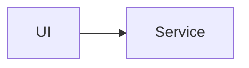
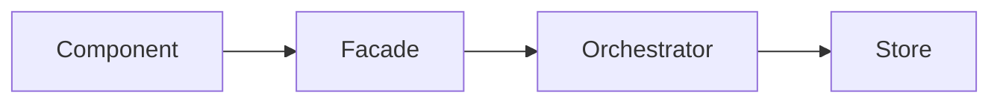
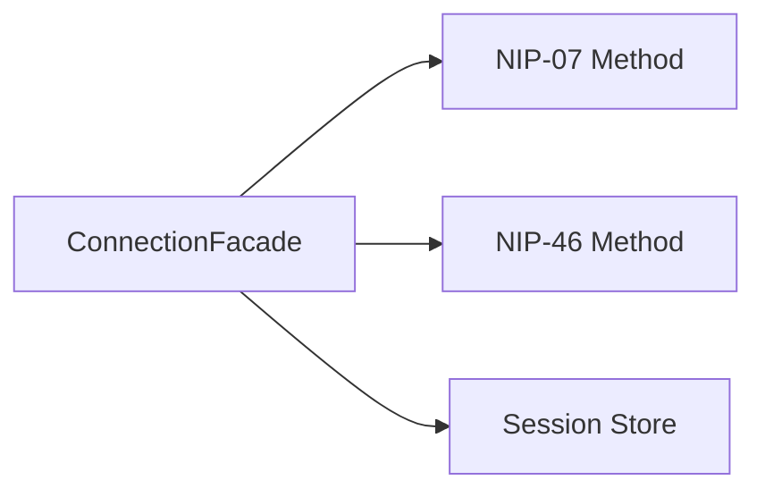
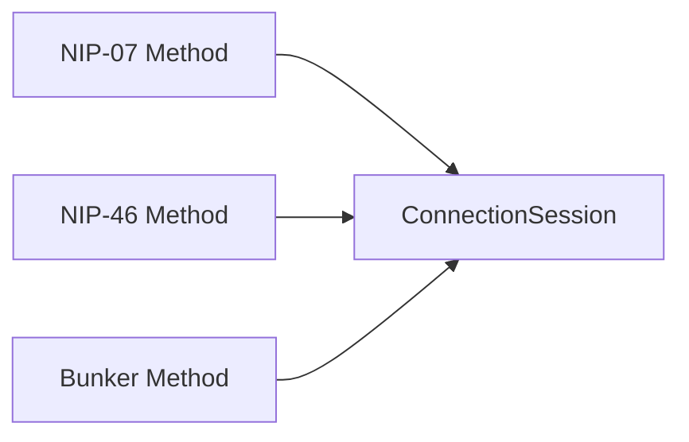
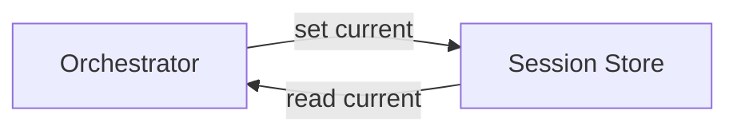

# Reading Mermaid Graphs

This guide explains how to read Mermaid diagrams without mixing up flows, calls, and dependencies.

The key rule: an arrow is read from source to target.

## Basic Rule

In a `flowchart`, read an arrow as a sentence:

- `A --> B` means `A` goes to `B`.
- In an calls diagram: `A` calls `B`.
- In a dependency diagram: `A` depends on `B`.
- In a flow diagram: something starts at `A` and arrives at `B`.

Outgoing arrows show what a node uses, calls, or feeds. Incoming arrows show who uses that node or sends something to it.

## Simple Relation

Read this as `UI` uses or calls `Service`. `Service` does not depend on `UI` in this diagram.

## Chain

Read this as:

- `Component` uses `Facade`.
- `Facade` uses `Orchestrator`.
- `Orchestrator` uses `Store`.

To find what `Facade` depends on, inspect outgoing arrows. To find who depends on `Facade`, inspect incoming arrows.

## Multiple Outgoing Dependencies

Outgoing arrows from `Facade` show the things `Facade` may use.

## Multiple Inputs

Multiple sources point to `ConnectionSession`, so multiple paths can produce or feed the same thing.

## Loops

Read each arrow separately. Opposite arrows do not automatically mean a circular dependency; they can describe two different actions.

## Orientation

- `LR` means left to right.
- `TD` means top down.

The visual direction changes, but the rule does not: the arrow tail is the source and the arrow head is the target.

## Subgraphs

`subgraph` groups nodes visually. It does not create or reverse dependencies.
