# Product Roadmap

Date: 2026-04-23
Updated: 2026-04-25
Status: active

## Role of this document

Ce document decrit la direction produit et l'ordre logique des prochains sujets.

Il ne remplace pas le board d'execution.
Pour le travail actif, utiliser [../planning/board.md](../planning/board.md).

Ce document ne suit pas le statut des tickets.
Le statut detaille (`In Progress`, `Ready`, `Blocked`, `Done`) reste uniquement dans le board.

## Contraintes produit actuelles

- Le produit reste gratuit pour l'instant.
- Le produit est une webapp/PWA, pas une app mobile native.
- L'auth desktop navigateur fonctionne deja de facon acceptable.
- La priorite immediate est l'auth mobile via application externe.
- `bunker://` reste disponible, mais n'est pas la voie UX principale pour le grand public.

## Roadmap

```mermaid
flowchart LR
  subgraph Now[Now]
    N0[Migrer DB vers Supabase]
    N1[Restaurer session Nostr apres refresh]
    A1[Fiabiliser l auth mobile application externe]
    A2[Rendre bunker utilisable en mode avance]
  end

  subgraph Next[Next]
    B1[Restaurer localement le signer Nostr Connect]
    B2[Reduire les permissions demandees au login]
    B3[Revoir l UX auth mobile]
  end

  subgraph Later[Later]
    C1[Dashboard admin membres]
    C2[Merge followers tool]
    C3[Feed pack francophone]
  end

  N0 --> N1 --> A1 --> A2 --> B1 --> B2 --> B3 --> C1
  C1 --> C2 --> C3
```

## Priority Themes

| Priority | Theme                              | Outcome attendu                                                 |
| -------- | ---------------------------------- | --------------------------------------------------------------- |
| P0       | Persistance donnees Supabase       | Les pack requests survivent aux redeploiements                  |
| P0       | Persistance session Nostr          | Refresh ne casse pas une autorisation NIP-07 / NIP-46 valide    |
| P0       | Systeme documentaire lisible       | Savoir ou lire, ecrire, historiser et planifier sans ambiguite  |
| P1       | Auth mobile application externe    | Un flow Alby/mobile fiable sans relancer plusieurs tentatives   |
| P1       | Restore local signer Nostr Connect | Eviter de repartir de zero apres reload ou retour sur le site   |
| P1       | Loader / disabled sur boutons auth | Eviter double-clic et donner un retour visuel pendant l'attente |
| P2       | Permissions plus fines             | Moins de friction et moins de prompts                           |
| P2       | UX auth mobile                     | Etats plus explicites : connexion, reprise, echec, read-only    |
| P3       | Bunker                             | Le garder utile sans le faire porter l'UX principale            |

## Related Documents

- Vision produit : [mission.md](mission.md)
- Spec auth mobile : [specs/auth-mobile-web.md](specs/auth-mobile-web.md)
- Board d'execution : [../planning/board.md](../planning/board.md)
