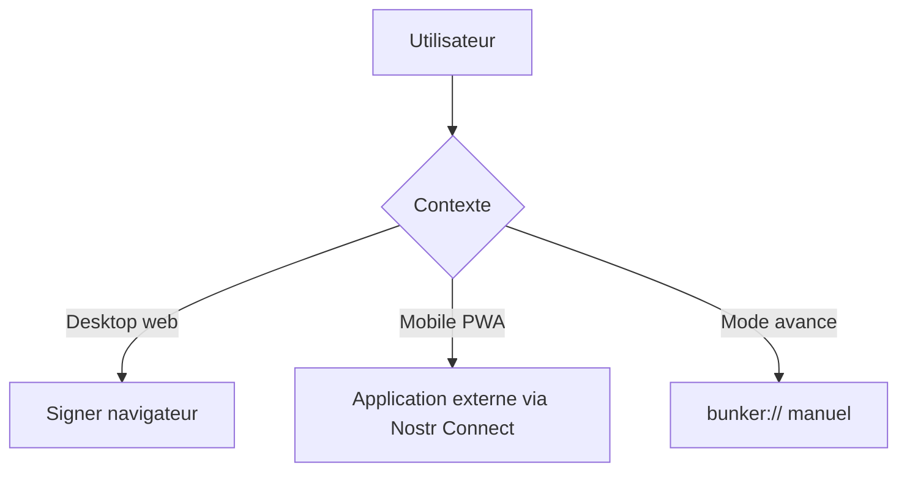
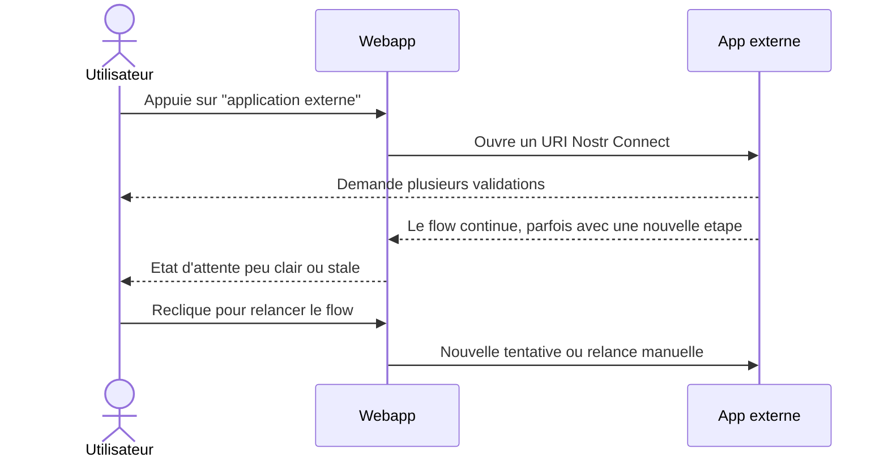
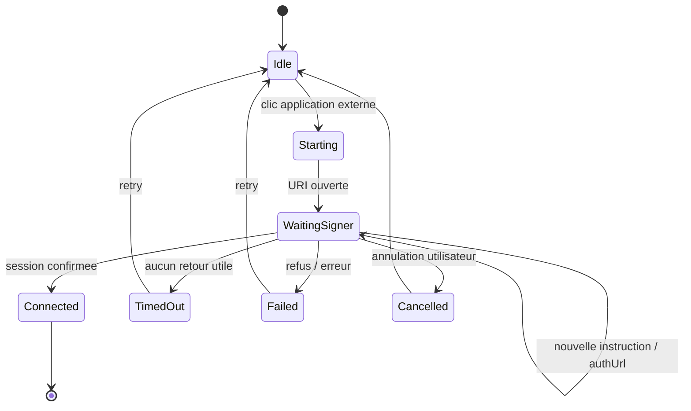

# Auth Mobile Web UX Spec

Date: 2026-04-23
Updated: 2026-04-24
Status: draft

## Role of this document

Ce document decrit le comportement UX cible pour l'auth mobile de la webapp.

Il ne remplace pas la roadmap.
Il sert a raffiner les user stories, les flows et les criteres d'acceptation.

## Contexte

- Le produit est une webapp.
- Le produit cible mobile est une PWA (pas une app native).
- Sur desktop, le chemin principal reste le signer navigateur.
- Sur mobile, le chemin principal est `Nostr Connect` via application externe, par exemple Alby.
- Le flow actuel est percu comme lent et fragile : l'utilisateur doit parfois recliquer pour relancer l'auth.

## Objectifs

- Un utilisateur mobile comprend en un coup d'oeil quelle methode utiliser.
- Le premier clic ouvre bien l'application externe.
- Une tentative auth en plusieurs etapes reste la meme tentative, sans restart inutile.
- Le retour sur le site est clair : connecte, en attente, timeout, echec.
- Le mode `bunker://` reste disponible pour les usages avances.
- Le backend reste en auth `NIP-98` stateless (pas de session serveur).
- Le produit reste gratuit et n'introduit pas de mur payant.

## Non-goals

- Construire une app native Android ou iOS.
- Faire de `bunker://` le chemin principal grand public.
- Resoudre dans cette spec toute la dette protocolaire de NIP-46.
- Introduire un modele de session backend (cookie, JWT, session serveur).
- Transformer une checklist securite de recherche en gate obligatoire de merge pour ce chantier.

## User stories

- En tant qu'utilisateur mobile, je veux appuyer une fois sur `Application externe` et poursuivre mon auth sans avoir a comprendre le protocole.
- En tant qu'utilisateur mobile, je veux pouvoir revenir sur le site et savoir si la connexion est en cours, reussie ou bloquee.
- En tant qu'utilisateur recurrent, je veux eviter de refaire un pairing complet si ma session locale est encore exploitable.
- En tant qu'utilisateur avance, je veux garder un acces `bunker://`, mais sans que cela complique l'UX par defaut.

## Entry Points

## Current Pain Flow

## Target Flow

## Acceptance Criteria

- Le bouton `application externe` ouvre l'application des le premier clic.
- Si le signer renvoie une nouvelle instruction pendant la meme tentative, la webapp suit cette instruction sans restart complet.
- L'utilisateur n'a pas besoin de demarrer une nouvelle tentative juste pour finir la meme auth.
- L'UI expose des etats explicites : `en attente`, `reessayer`, `annuler`, `deconnecter`.
- L'auth backend reste `NIP-98` stateless, sans session serveur.
- `bunker://` reste present mais secondaire.

## Open Questions

- Quelle strategie de reprise locale retenir dans une iteration suivante (`AUTH-02`) ?
- Quelles permissions minimales doivent etre demandees au login initial ?
- A quel moment precise afficher un mode lecture seule dans l'UX auth ?
