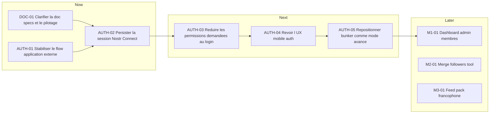

# Product Roadmap and Board

Date: 2026-04-23
Updated: 2026-04-23
Status: active

Ce document est la source de verite active pour :

- la roadmap produit immediate
- le board des prochaines taches
- les sujets bloques qui demandent une decision

Si ce document contredit un plan historique, ce document gagne.

## Contraintes produit actuelles

- Le produit reste gratuit pour l'instant.
- Le produit est une webapp, pas une app mobile native.
- L'auth desktop navigateur fonctionne deja de facon acceptable.
- La priorite produit immediate est l'auth mobile via application externe.
- `bunker://` reste disponible, mais n'est pas la voie UX principale pour le grand public.

## Roadmap

## Priorites

| Priority | Topic                             | Outcome attendu                                               |
| -------- | --------------------------------- | ------------------------------------------------------------- |
| P0       | Clarte docs + board               | Savoir quel document sert a quoi et ou regarder               |
| P1       | Auth mobile application externe   | Un flow Alby/mobile fiable sans relancer plusieurs tentatives |
| P1       | Session Nostr Connect persistante | Eviter de repartir de zero apres reload ou retour sur le site |
| P2       | Permissions plus fines            | Moins de friction et moins de prompts                         |
| P2       | UX auth mobile                    | Etats plus explicites : connexion, reprise, echec, read-only  |
| P3       | Bunker                            | Le garder utile sans le faire porter l'UX principale          |

## Board

### Ready

- `AUTH-02` Persister la session `Nostr Connect` dans la webapp.
  Done when: un utilisateur mobile peut revenir sur le site sans refaire un pairing complet tant que la session locale est encore valable.

- `AUTH-03` Reduire les permissions demandees au login au strict necessaire.
  Done when: le flow de login ne demande que ce qui est utile au demarrage, puis les autres permissions arrivent au besoin.

- `AUTH-04` Revoir l'UX auth mobile.
  Done when: l'UI affiche clairement l'etat du signer actif, propose `Reouvrir l'application`, `Reessayer`, `Se deconnecter`, et un mode lecture seule explicite.

- `AUTH-05` Faire de `bunker://` un mode avance clairement separe.
  Done when: l'utilisateur grand public voit d'abord l'application externe, bunker n'apparait plus comme le chemin principal.

### Blocked

- `AUTH-06` One-shot perms bunker complet.
  Blocker: avec notre stack NDK actuelle, le flow bunker ne donne pas un point propre pour pousser toutes les requested perms dans `connect`.
  Decision needed: patch NDK, contourner avec une impl bas niveau, ou accepter bunker comme flow plus avance et moins optimise.

### Done Recently

- `DOC-01` Clarifier le role des specs et creer un document actif de pilotage.

- `AUTH-01` Corriger le flow application externe pour :
  - ouvrir l'application au premier clic
  - suivre les mises a jour d'URI pendant la tentative
  - eviter le besoin de relancer une nouvelle tentative juste pour poursuivre le meme flow

## Regles de maintien du board

- Une tache doit avoir un identifiant stable.
- Une tache doit dire ce qu'on veut obtenir, pas seulement ce qu'on va coder.
- `Ready` = executable sans nouvelle decision produit majeure.
- `Blocked` = besoin d'une decision, d'une verification externe ou d'un changement de stack.
- `Done Recently` = garder uniquement les derniers changements utiles a la conversation.
