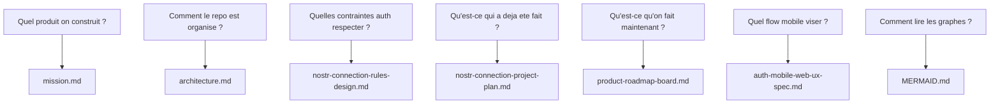

# Specs Index

Updated: 2026-04-23

Ce dossier contient les specs produit et les documents de pilotage.

Le principe a partir de maintenant :

- un document de reference explique les contraintes
- un document historique garde la memoire des chantiers passes
- un document actif pilote la roadmap et le board
- un document de spec decrit le comportement UX cible quand on affine un sujet

## Quelle question -> quel document

| Question                                        | Document a lire                               | Role                                          |
| ----------------------------------------------- | --------------------------------------------- | --------------------------------------------- |
| Quel produit on construit ?                     | `../documentation/mission.md`                 | Vision produit, milestones, limites de scope  |
| Comment le code est organise ?                  | `../documentation/architecture.md`            | Structure du repo, couches, dependances       |
| Quelles contraintes auth sont acceptables ?     | `2026-04-21-nostr-connection-rules-design.md` | Regles de conception et de protocole          |
| Qu'est-ce qui a deja ete fait sur l'auth ?      | `2026-04-21-nostr-connection-project-plan.md` | Journal historique du refactor auth           |
| Qu'est-ce qu'on fait maintenant ?               | `2026-04-23-product-roadmap-board.md`         | Source de verite active pour roadmap et board |
| Comment le flow auth mobile doit se comporter ? | `2026-04-23-auth-mobile-web-ux-spec.md`       | Spec UX en cours de refinement                |
| Comment lire les graphes Mermaid ?              | `../../../MERMAID.md`                         | Guide de lecture Mermaid                      |

## Statuts de document

- `reference` : regles stables a consulter avant de changer le code
- `historical` : memoire d'un chantier passe, utile pour comprendre les decisions
- `active` : source de verite du travail en cours
- `draft` : spec en cours de refinement

## Carte de lecture

## Regles de maintenance

- Le document actif de pilotage est `2026-04-23-product-roadmap-board.md`.
- Si un doc historique contredit le board actif, le board actif gagne.
- Une spec UX ne remplace pas la roadmap : elle decrit le comportement cible, pas l'ordre d'execution.
- On garde les vieux plans pour l'historique, mais on n'y remet pas la todo courante.
