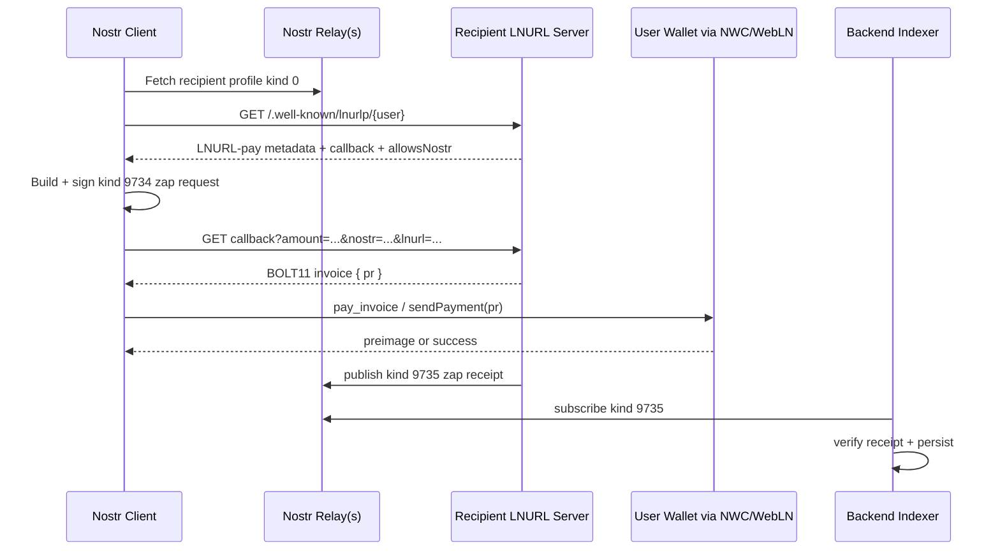

# Nostr + Lightning Zaps — Technical Integration Document

_Last updated: 2026-05-02_

Source note: preserved from the local technical draft after fetching `https://chatgpt.com/s/t_69f6f10168348191ae99d5bed838d52b`. The fetchable page exposed only the conversation title, so this maintained document uses the complete local draft content.

This document describes a technical architecture for integrating Bitcoin Lightning zaps in a Nostr client or Nostr-adjacent product. It focuses on a non-custodial first implementation using NIP-57 zaps, LNURL-pay, Lightning Address, WebLN, and Nostr Wallet Connect.

---

## 1. Recommended architecture

For a first production version, use a **non-custodial payer model**:

```txt
Nostr client
  ├─ resolves recipient lud16/lud06
  ├─ builds signed NIP-57 zap request
  ├─ asks LNURL server for invoice
  ├─ pays invoice via WebLN or NWC
  └─ waits for NIP-57 zap receipt

Backend
  ├─ indexes verified zap receipts
  ├─ stores accounting / analytics
  ├─ optionally exposes ranking / reputation / gating
  └─ never touches user wallet keys
```

The clean separation is:

```txt
LNURL-pay / NIP-57 → invoice generation
WebLN / NWC        → invoice payment
Backend           → receipt indexing, verification, analytics
```

LNURL-pay returns a callback URL, payment bounds, and metadata. The callback then returns a BOLT11 invoice. The wallet should verify the invoice amount and the `h` description hash before paying.

For human-readable payment identifiers, use **Lightning Address / LUD-16**. A value like:

```txt
alice@example.com
```

resolves to:

```txt
https://example.com/.well-known/lnurlp/alice
```

and then follows the normal LUD-06 LNURL-pay flow.

---

## 2. Protocol responsibilities

| Layer                   | Spec            | Role                                                              |
| ----------------------- | --------------- | ----------------------------------------------------------------- |
| Invoice format          | BOLT11          | Encoded Lightning invoice, payment hash, description/hash, expiry |
| Recipient resolution    | LUD-16 / LUD-06 | Lightning Address or LNURL-pay endpoint                           |
| Zap semantics           | NIP-57          | Zap request `9734`, zap receipt `9735`                            |
| Wallet payment          | NIP-47 NWC      | Remote wallet payment over encrypted Nostr events                 |
| Browser wallet fallback | WebLN           | `window.webln.sendPayment(invoice)`                               |

BOLT11 invoices are Bech32-encoded Lightning payment requests. Relevant fields for zaps are:

| Field | Meaning                  |
| ----- | ------------------------ |
| `p`   | Payment hash             |
| `h`   | Description hash         |
| `d`   | Direct short description |
| `x`   | Expiry                   |

BOLT11 requires exactly one payment hash and either a direct description or a description hash.

---

## 3. End-to-end zap flow



NIP-57 specifies that the signed `9734` zap request is **not published to relays**. It is sent to the recipient LNURL callback. The callback returns a JSON object containing `pr`, the invoice to pay.

After payment, the recipient’s LNURL server publishes a `9735` zap receipt to the relays declared in the zap request.

---

## 4. Frontend modules

### 4.1 Recipient resolver

Input:

```ts
type ZapTarget = {
  recipientPubkey: string;
  eventId?: string;
  eventKind?: number;
  addressableCoordinate?: string;
  lud16?: string;
  lud06?: string;
};
```

Resolution order:

```txt
1. If target profile has lud16:
   GET https://domain/.well-known/lnurlp/name

2. Else if target profile has lud06:
   bech32-decode LNURL
   GET decoded URL

3. Validate response:
   tag === "payRequest"
   amountMsat between minSendable and maxSendable
   allowsNostr === true for proper zap support
   nostrPubkey exists for future receipt verification
```

For zap support, NIP-57 extends the LNURL-pay response with:

```json
{
  "allowsNostr": true,
  "nostrPubkey": "<recipient-lnurl-server-pubkey>"
}
```

`nostrPubkey` is the key expected to sign zap receipts.

---

### 4.2 Zap request builder

A zap request is a signed Nostr event of kind `9734`.

```ts
type ZapRequestEvent = {
  kind: 9734;
  content: string;
  pubkey: string;
  created_at: number;
  tags: string[][];
  id: string;
  sig: string;
};
```

Minimum tags:

```ts
[
  ['relays', 'wss://relay1.example', 'wss://relay2.example'],
  ['amount', String(amountMsat)],
  ['lnurl', encodedLnurl],
  ['p', recipientPubkey],
];
```

For event zaps, add:

```ts
['e', eventId][('k', String(eventKind))];
```

For addressable events, add:

```ts
['a', addressableCoordinate];
```

NIP-57 requires the `p` tag, recommends `amount` and `lnurl`, and uses `e`, `a`, and `k` to bind the zap to a specific note or addressable event.

---

### 4.3 Invoice request

```ts
const callbackUrl = new URL(lnurlPay.callback);

callbackUrl.searchParams.set('amount', String(amountMsat));
callbackUrl.searchParams.set('nostr', JSON.stringify(zapRequest));
callbackUrl.searchParams.set('lnurl', encodedLnurl);

const res = await fetch(callbackUrl);
const { pr } = await res.json();
```

Validation before payment:

```txt
- Decode BOLT11 invoice.
- Check invoice amount == requested amountMsat.
- Check invoice description_hash == sha256(JSON.stringify(zapRequest)).
- Check invoice has not expired.
- Check LNURL response domain matches expected recipient.
```

NIP-57 says the zap invoice description hash should commit to the zap request event only, not extra LNURL metadata.

---

## 5. Payment layer

### 5.1 Option A — WebLN

Use this when the user has a browser wallet extension or injected provider.

```ts
await window.webln.enable();
const result = await window.webln.sendPayment(invoice);
console.log(result.preimage);
```

WebLN’s `sendPayment` asks the user’s wallet to pay a provided BOLT11 invoice and returns a payment preimage on success.

Pros:

```txt
- Simple browser integration
- Good for extensions
- Familiar pattern for Lightning web apps
```

Cons:

```txt
- Requires an injected provider
- Less suitable for mobile-first flows
- Less flexible for persistent app-wallet pairing
```

---

### 5.2 Option B — Nostr Wallet Connect / NIP-47

Use this for persistent wallet pairing, mobile apps, server-side agents, or native apps.

NWC works through a `nostr+walletconnect://` URI containing:

```txt
wallet service pubkey
relay URL(s)
client secret
optional lud16
```

NIP-47 uses encrypted Nostr events:

| Kind    | Purpose             |
| ------- | ------------------- |
| `13194` | Wallet information  |
| `23194` | Request             |
| `23195` | Response            |
| `23197` | NIP-44 notification |

The client uses the secret from the connection URI to sign and encrypt requests.

Payment request:

```json
{
  "method": "pay_invoice",
  "params": {
    "invoice": "lnbc...",
    "amount": 21000,
    "metadata": {
      "type": "nostr-zap",
      "recipient": "<pubkey>",
      "event": "<event-id>"
    }
  }
}
```

Successful NWC response:

```json
{
  "result_type": "pay_invoice",
  "result": {
    "preimage": "0123456789abcdef...",
    "fees_paid": 123
  }
}
```

The `pay_invoice` method accepts a BOLT11 invoice, optional amount in millisats, and optional metadata. It returns a preimage and optionally fees paid.

For JavaScript projects, Alby’s SDK exposes both a direct `NWCClient` and a `NostrWebLNProvider`, which lets NWC behave like a WebLN provider.

---

## 6. Receipt verification

Your backend or indexer should subscribe to relays for events of kind `9735`.

Verification algorithm:

```txt
1. Parse zap receipt event.
2. Verify Nostr event signature.
3. Check receipt pubkey == nostrPubkey from LNURL-pay response.
4. Extract `description` tag.
5. Parse `description` as original kind 9734 zap request.
6. Verify zap request signature.
7. Check zap request tags:
   - exactly one recipient `p`
   - optional `e`
   - optional `a`
   - amount matches expected query amount if present
8. Extract `bolt11` tag.
9. Decode BOLT11 invoice.
10. Check sha256(description) == invoice description_hash.
11. Store receipt.
```

NIP-57 requires zap receipts to contain:

```txt
- a `bolt11` tag
- a `description` tag containing the JSON-encoded zap request
```

It also states that `SHA256(description)` should match the BOLT11 description hash.

The optional `preimage` tag is not strong independent proof. Clients still trust the zap receipt signer.

Recommended DB table:

```sql
create table zap_receipts (
  id text primary key,
  receipt_pubkey text not null,
  sender_pubkey text,
  recipient_pubkey text not null,
  target_event_id text,
  target_coordinate text,
  target_kind int,
  amount_msat bigint not null,
  bolt11 text not null,
  payment_hash text,
  preimage text,
  description_json jsonb not null,
  relay_urls text[],
  created_at timestamptz not null,
  verified_at timestamptz not null
);
```

Suggested additional indexes:

```sql
create index zap_receipts_recipient_idx
  on zap_receipts (recipient_pubkey, created_at desc);

create index zap_receipts_target_event_idx
  on zap_receipts (target_event_id, created_at desc);

create index zap_receipts_payment_hash_idx
  on zap_receipts (payment_hash);
```

---

## 7. Receiving zaps for your own service

If your service needs to receive zaps directly, you need an LNURL-pay server.

Endpoint:

```http
GET /.well-known/lnurlp/:username
```

Response:

```json
{
  "callback": "https://api.example.com/lnurl/callback/:username",
  "maxSendable": 210000000,
  "minSendable": 1000,
  "metadata": "[[\"text/plain\",\"Zap @alice on Example\"]]",
  "tag": "payRequest",
  "allowsNostr": true,
  "nostrPubkey": "<your-zap-receipt-signer-pubkey>"
}
```

Callback:

```http
GET /lnurl/callback/:username?amount=21000&nostr=<encoded-event>&lnurl=<encoded-lnurl>
```

Callback logic:

```txt
1. Validate amount within min/max.
2. Decode and parse `nostr`.
3. Verify Nostr signature.
4. Validate NIP-57 tags.
5. Store zap request by deterministic invoice label.
6. Create Lightning invoice with description_hash = sha256(zapRequestJson).
7. Return { pr, routes: [] }.
8. On invoice settlement, publish kind 9735 zap receipt.
```

For LND, use a restricted macaroon for invoice creation where possible. Default admin-level authority should not be exposed to web-facing applications.

---

## 8. Custody and remote signer model

Avoid backend-controlled payments unless the product requires one of the following:

```txt
- subscriptions
- automated payouts
- custodial balances
- escrow
- agentic spending
- business-controlled budget accounts
```

If you operate your own Lightning node, stronger setups split the node into:

```txt
watch-only / network-facing node
  └─ remote signer holding private keys
```

LND remote signing separates a watch-only node from a signer node containing private keys. The signer can be isolated from the public Lightning network and exposed only through a restricted gRPC connection.

For higher security, validating signers such as VLS add policy checks before signing, instead of blindly signing every request from the node.

If you create user balances on top of your own node, that becomes custodial infrastructure. LND Accounts supports virtual off-chain accounts enforced by macaroons and spending rules, but users enter a trust relationship with the node operator.

---

## 9. Security checklist

Treat every NWC URI as a spending credential. It contains a secret used by the client to sign and encrypt wallet requests.

Storage rules:

```txt
- Prefer local encrypted storage.
- Prefer secure enclave or OS keychain where available.
- If stored server-side, encrypt at rest.
- Redact NWC URIs from logs.
- Scope wallet connections with budgets and expiry.
```

Use NIP-44 encryption for NWC when supported. NIP-47 says NIP-44 should be preferred, with NIP-04 retained only for legacy compatibility.

Operational protections:

```txt
- Never log NWC URLs.
- Never log macaroons.
- Never expose admin.macaroon to a web app.
- Dedupe receipts by receipt id and payment_hash.
- Add request expiration tags for NWC requests.
- Use multiple relays for zap receipt delivery.
- Preserve raw LNURL metadata string; do not reserialize before hashing.
- Verify invoice amount in millisats.
- Verify BOLT11 expiry before payment.
- Rate-limit callback and zap verification endpoints.
```

---

## 10. Minimal implementation plan

### Phase 1 — Client-side zaps

```txt
- Resolve lud16/lud06.
- Build and sign NIP-57 request.
- Fetch BOLT11 from callback.
- Pay via WebLN or NWC.
- Display optimistic pending state.
```

### Phase 2 — Verified social layer

```txt
- Subscribe to relays for kind 9735.
- Verify receipts.
- Store indexed zap receipts.
- Aggregate zaps by event/profile.
```

### Phase 3 — Own receiving infrastructure

```txt
- Implement /.well-known/lnurlp/:user.
- Implement callback.
- Create invoices through LND/CLN/provider.
- Publish NIP-57 receipts after settlement.
```

### Phase 4 — Advanced payments

```txt
- NWC budgets / scoped connections.
- Subscriptions.
- Paid actions.
- Paywalled content.
- Agentic spending.
- Remote signer if operating your own node.
```

For this use case, the best first technical target is:

```txt
NIP-57 zap client
+ NWC/WebLN payer
+ backend receipt verifier
```

This gives one-tap zaps without handling user funds.

---

## 11. Suggested frontend API shape

```ts
export type ZapAmountMsat = number;

export type LightningAddress = string;
export type NostrPubkey = string;
export type NostrEventId = string;

export type ResolvedLnurlPay = {
  callback: string;
  minSendable: number;
  maxSendable: number;
  metadata: string;
  tag: 'payRequest';
  allowsNostr?: boolean;
  nostrPubkey?: string;
};

export type ZapRequestInput = {
  senderPubkey: NostrPubkey;
  recipientPubkey: NostrPubkey;
  amountMsat: ZapAmountMsat;
  relays: string[];
  lnurl: string;
  content?: string;
  eventId?: NostrEventId;
  eventKind?: number;
  addressableCoordinate?: string;
};

export type ZapInvoiceResult = {
  invoice: string;
  zapRequest: unknown;
  amountMsat: number;
};

export type ZapPaymentResult = {
  preimage?: string;
  feesPaidMsat?: number;
};
```

Suggested service boundaries:

```ts
export interface LnurlResolver {
  resolve(input: { lud16?: string; lud06?: string }): Promise<ResolvedLnurlPay>;
}

export interface ZapRequestSigner {
  buildAndSign(input: ZapRequestInput): Promise<unknown>;
}

export interface ZapInvoiceRequester {
  requestInvoice(input: {
    lnurlPay: ResolvedLnurlPay;
    amountMsat: number;
    encodedLnurl: string;
    zapRequest: unknown;
  }): Promise<ZapInvoiceResult>;
}

export interface LightningPayer {
  payInvoice(invoice: string): Promise<ZapPaymentResult>;
}

export interface ZapReceiptVerifier {
  verify(receipt: unknown): Promise<VerifiedZapReceipt>;
}
```

---

## 12. Backend receipt indexing model

A basic backend flow:

```txt
1. Maintain relay subscriptions for kind 9735.
2. Receive candidate receipt events.
3. Verify the receipt.
4. Decode and normalize payment data.
5. Store raw event and normalized projection.
6. Expose query endpoints to frontend.
```

Example query endpoints:

```http
GET /api/zaps/by-event/:eventId
GET /api/zaps/by-profile/:pubkey
GET /api/zaps/leaderboard?period=24h
GET /api/zaps/recent
```

Example response:

```json
{
  "eventId": "<event-id>",
  "totalMsat": 210000,
  "count": 4,
  "zaps": [
    {
      "senderPubkey": "<sender>",
      "recipientPubkey": "<recipient>",
      "amountMsat": 21000,
      "createdAt": "2026-05-02T10:00:00Z",
      "receiptId": "<9735-event-id>"
    }
  ]
}
```

---

## 13. Main failure modes

| Failure                             | Cause                                         | Handling                                |
| ----------------------------------- | --------------------------------------------- | --------------------------------------- |
| Recipient has no `lud16` or `lud06` | Profile not zap-enabled                       | Hide zap button or show setup prompt    |
| `allowsNostr` is false              | LNURL-pay supports payments but not zaps      | Offer normal Lightning payment, not zap |
| Invoice amount mismatch             | Malicious or buggy callback                   | Reject before payment                   |
| Description hash mismatch           | Invoice not bound to zap request              | Reject before payment                   |
| Payment succeeds but no receipt     | LNURL server failed to publish or relay issue | Show pending/unverified state           |
| Duplicate receipts                  | Relay duplication or retries                  | Dedupe by receipt id/payment hash       |
| NWC request timeout                 | Wallet offline or relay failure               | Retry with same invoice if still valid  |
| Invoice expired                     | User delayed payment                          | Request a fresh invoice                 |

---

## 14. References

- [NIP-57 — Lightning Zaps](https://nips.nostr.com/57)
- [NIP-47 — Nostr Wallet Connect](https://nips.nostr.com/47)
- [LUD-06 — LNURL-pay](https://github.com/lnurl/luds/blob/luds/06.md)
- [LUD-16 — Lightning Address](https://github.com/fiatjaf/lnurl-rfc/blob/luds/16.md)
- [BOLT11 — Lightning payment request encoding](https://github.com/lightning/bolts/blob/master/11-payment-encoding.md)
- [WebLN — sendPayment](https://www.webln.dev/client/send-payment)
- [Alby NWC JavaScript SDK guide](https://guides.getalby.com/developer-guide/developer-guide/nostr-wallet-connect-api/building-lightning-apps/nwc-js-sdk)
- [LND macaroons documentation](https://docs.lightning.engineering/lightning-network-tools/lnd/macaroons)
- [LND remote signing documentation](https://github.com/lightningnetwork/lnd/blob/master/docs/remote-signing.md)
- [VLS — Validating Lightning Signer](https://vls.tech/docs/v0.14.0/overview/intro/)
- [LND Accounts](https://docs.lightning.engineering/lightning-network-tools/lightning-terminal/accounts)
