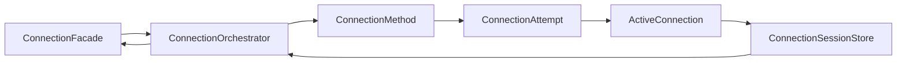
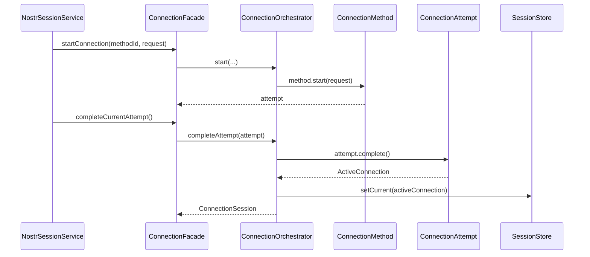

# Core Nostr Connection

Ce dossier implemente le domaine de connexion Nostr de maniere decouplee : methodes de connexion, tentatives, session, capabilities et orchestration.

## Fichiers clefs

- [ConnectionFacade](./application/connection-facade.ts)
- [ConnectionOrchestrator](./application/connection-orchestrator.ts)
- [Default orchestrator wiring](./application/default-connection-orchestrator.ts)
- [NIP-07 method](./application/nip07-connection-method.ts)
- [NIP-46 nostrconnect method](./application/nip46-nostrconnect-connection-method.ts)
- [NIP-46 bunker method](./application/nip46-bunker-connection-method.ts)
- [Connection session model](./domain/connection-session.ts)

## Architecture de flux

## Workflow login (generic)

## Methodes supportees

- `nip07` (extension navigateur) :
  - [nip07-connection-method.ts](./application/nip07-connection-method.ts)
  - [nip07-connection-signer.ts](./application/nip07-connection-signer.ts)
- `nip46-nostrconnect` (URI + app externe) :
  - [nip46-nostrconnect-connection-method.ts](./application/nip46-nostrconnect-connection-method.ts)
  - [ndk-nip46-nostrconnect-starter.ts](./infrastructure/ndk-nip46-nostrconnect-starter.ts)
- `nip46-bunker` (token bunker://...) :
  - [nip46-bunker-connection-method.ts](./application/nip46-bunker-connection-method.ts)
  - [ndk-nip46-bunker-starter.ts](./infrastructure/ndk-nip46-bunker-starter.ts)

## Session et identite

- normalisation pubkey hex + generation `npub` : [connection-session.ts](./domain/connection-session.ts)
- detection de changement d'identite : `didConnectionIdentityChange(...)` dans le meme fichier

## Auth HTTP NIP-98

Le port NIP-98 est dans ce domaine :

- [Nip98HttpAuthService](./application/nip98-http-auth.service.ts)
- [HttpAuth types](./domain/http-auth.ts)

Il est consomme par `core/nostr` pour signer les appels API.
