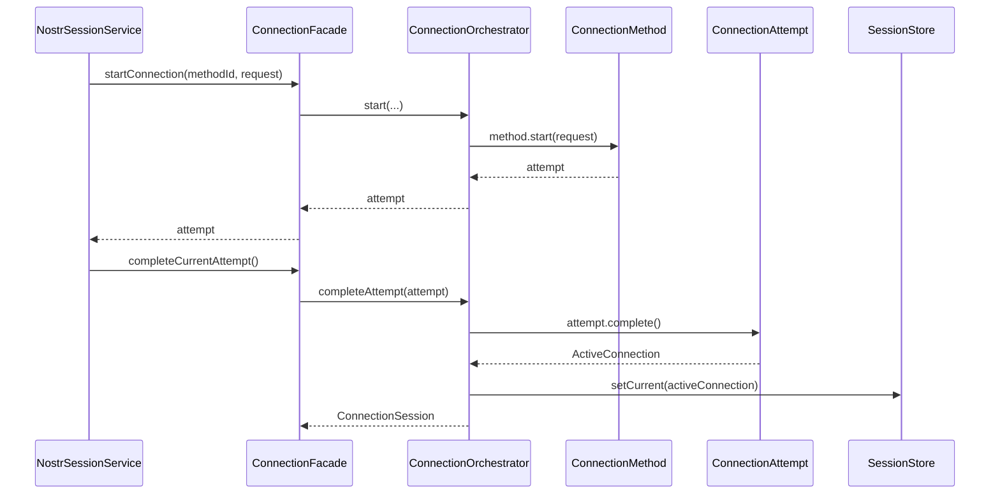
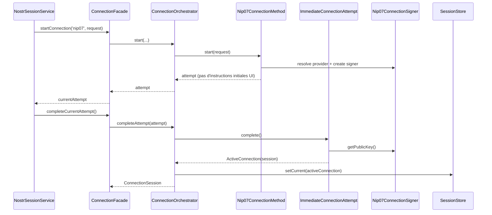
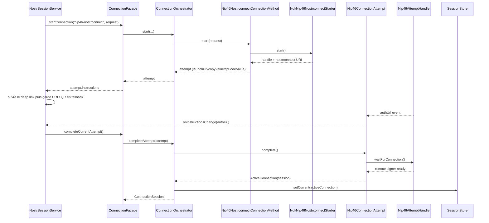
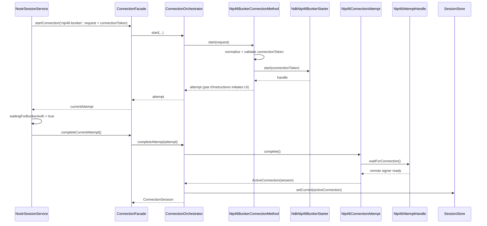

# Core Nostr Connection

Ce dossier implemente le domaine de connexion Nostr de maniere decouplee : methodes de connexion, tentatives, session locale, capabilities et orchestration.

Il ne cree pas de session backend: le frontend obtient un signer local, puis les appels API proteges restent verifies via `NIP-98`.

## Fichiers clefs

- [ConnectionFacade](./application/connection-facade.ts)
- [Auth session state model](./domain/auth-session-state.ts)
- [ConnectionOrchestrator](./application/connection-orchestrator.ts)
- [Default orchestrator wiring](./application/default-connection-orchestrator.ts)
- [NIP-07 method](./application/nip07-connection-method.ts)
- [NIP-46 nostrconnect method](./application/nip46-nostrconnect-connection-method.ts)
- [NIP-46 bunker method](./application/nip46-bunker-connection-method.ts)
- [Connection attempt model](./domain/connection-attempt.ts)
- [Connection session model](./domain/connection-session.ts)

## Architecture de flux

```mermaid
flowchart LR
  Facade[ConnectionFacade]
  Orchestrator[ConnectionOrchestrator]
  Method[ConnectionMethod]
  Attempt[ConnectionAttempt]
  Active[ActiveConnection]
  Store[ConnectionSessionStore]

  Facade -->|start / complete| Orchestrator
  Orchestrator -->|start(request)| Method
  Method -->|attempt| Attempt
  Attempt -->|complete()| Active
  Active -->|setCurrent| Store
  Store -->|read current / revalidate| Orchestrator
  Orchestrator -->|session| Facade
```

## Workflow login (generic)



Lecture generique :

1. l'UI demarre une methode de connexion
2. la methode retourne une `ConnectionAttempt`
3. l'UI complete ensuite cette tentative
4. la tentative produit une `ActiveConnection`
5. l'orchestrateur stocke cette connexion et expose une `ConnectionSession`

## Persistance / restore

Etat actuel: la connexion active est stockee en memoire via `InMemoryConnectionSessionStore`.
Pour `nip07`, un contexte de restauration minimal est persiste en local (`version`, `methodId`, `pubkeyHex`, `validatedAt`) afin de revalider silencieusement une session apres refresh.

Consequence:

- apres reload de la PWA, l'utilisateur doit relancer un flow `nip46-nostrconnect` ou `nip46-bunker`;
- apres reload avec `nip07`, l'application tente une restauration en relisant `window.nostr.getPublicKey()` puis en comparant la pubkey avec le contexte persiste;
- aucun modele de session backend n'est introduit;
- le backend continue a verifier les requetes avec `NIP-98`.

Important: le contexte persiste n'est jamais une preuve d'authentification. Seule la validation courante du signer peut produire l'etat `connected`.

Ce qui change selon la methode :

- `nip07` : tentative immediate, sans instructions UI, sans app externe
- `nip46-nostrconnect` : tentative avec URI/QR/deep link, puis attente d'une autorisation externe
- `nip46-bunker` : tentative basee sur un `bunker://...`, sans instructions initiales pour l'UI, puis attente d'une autorisation bunker

Contrat commun de tentative :

- `attempt.instructions` represente l'etat initial disponible juste apres `start()`
- `attempt.onInstructionsChange(...)` permet d'ecouter les mises a jour d'instructions pendant l'attente
- aujourd'hui, ce mecanisme sert surtout a faire remonter un `authUrl` NIP-46 plus specifique que l'URI initiale

## Workflow `nip07`

Cas d'usage : extension navigateur NIP-07 deja disponible dans le navigateur.



Points clefs :

- `start()` ne fait pas encore la session, il prepare une tentative immediate
- `instructions = null` : il n'y a rien a afficher ou scanner dans l'UI
- `complete()` lit la pubkey via le signer NIP-07, construit la session puis retourne une connexion active
- la revalidation relit ensuite la pubkey via le meme signer

## Workflow `nip46-nostrconnect`

Cas d'usage : l'app genere un URI nostrconnect puis attend qu'une app externe approuve la connexion.



Points clefs :

- `start()` cree d'abord un handle NIP-46 et expose des instructions UI
- l'UI resout l'URI externe via `authUrl ?? launchUrl ?? copyValue`
- la modal ouvre automatiquement l'URI disponible puis garde `copyValue` / QR comme fallback visible
- si le remote signer emet un `auth_url`, la tentative met a jour ses instructions via `onInstructionsChange(...)`
- `complete()` ne termine pas immediatement : il attend `waitForConnection()`
- une fois le signer distant pret, la tentative construit la session et l'orchestrateur la stocke

## Workflow `nip46-bunker`

Cas d'usage : l'utilisateur fournit un token `bunker://...` deja genere par un bunker distant.



Points clefs :

- `start()` exige un `connectionToken` dans la requete
- la methode verifie le schema `bunker://`, la pubkey bunker et au moins un relay URL
- le starter derive ses relays depuis le token avant de creer le signer bunker
- il n'y a pas d'instructions initiales utiles a afficher dans l'UI : le flow courant est surtout un etat d'attente bunker
- comme pour nostrconnect, `complete()` attend que le signer distant soit pret

## Methodes supportees

- `nip07` (extension navigateur) :
  - [nip07-connection-method.ts](./application/nip07-connection-method.ts)
  - [nip07-connection-signer.ts](./application/nip07-connection-signer.ts)
- `nip46-nostrconnect` (URI + app externe) :
  - [nip46-nostrconnect-connection-method.ts](./application/nip46-nostrconnect-connection-method.ts)
  - [ndk-nip46-nostrconnect-starter.ts](./infrastructure/ndk-nip46-nostrconnect-starter.ts)
- `nip46-bunker` (token bunker://...) :
  - [nip46-bunker-connection-method.ts](./application/nip46-bunker-connection-method.ts)
  - [ndk-nip46-bunker-starter.ts](./infrastructure/ndk-nip46-bunker-starter.ts)

## Session et identite

- normalisation pubkey hex + generation `npub` : [connection-session.ts](./domain/connection-session.ts)
- detection de changement d'identite : `didConnectionIdentityChange(...)` dans le meme fichier
- etat semantique partage de session/authentification : [auth-session-state.ts](./domain/auth-session-state.ts)

Le modele `AuthSessionState` est la source semantique unique des etats de connexion dans le domaine `nostr-connection`.
`ConnectionSession` reste la preuve d'une connexion valide cote signer, tandis que les donnees de profil (`SessionUser`)
restent des donnees d'affichage/copie de contexte et ne prouvent pas, a elles seules, l'authentification active.

## Auth HTTP NIP-98

Le port NIP-98 est dans ce domaine :

- [Nip98HttpAuthService](./application/nip98-http-auth.service.ts)
- [HttpAuth types](./domain/http-auth.ts)

Il est consomme par `core/nostr` pour signer les appels API.
