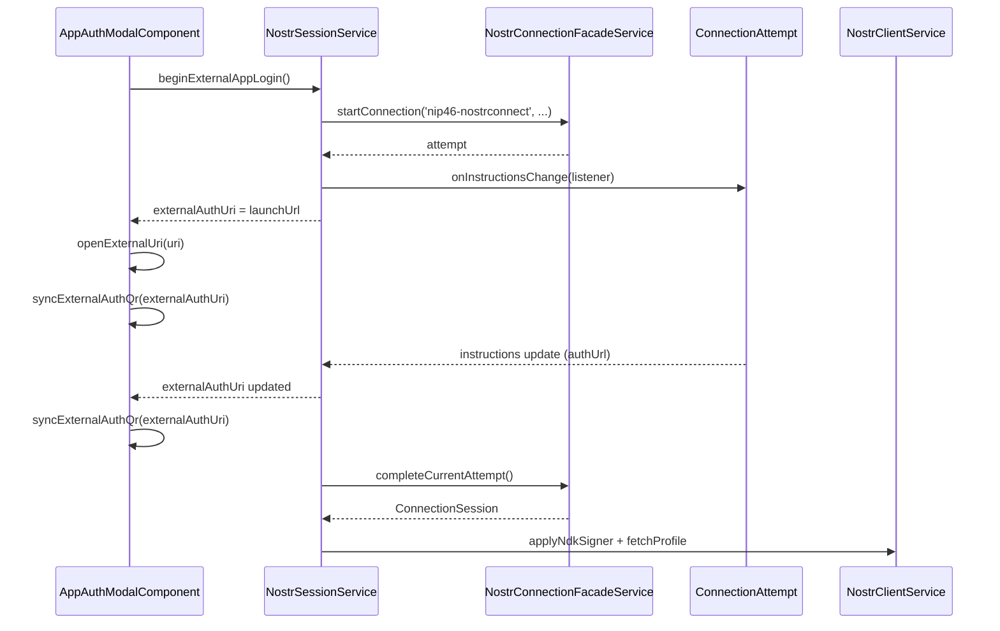
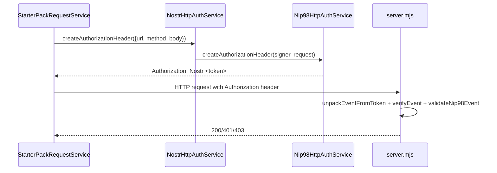

# Core Nostr

Ce dossier porte la couche applicative Nostr "utilisee par l'UI" : session utilisateur, client NDK, auth HTTP NIP-98 et operations metier simples (follow, DM, publication).

## Fichiers clefs

- [NostrSessionService](./application/nostr-session.service.ts)
- [NostrClientService](./application/nostr-client.service.ts)
- [NostrHttpAuthService](./application/nostr-http-auth.service.ts)
- [FollowService](./application/follow.service.ts)
- [Relay config](./infrastructure/relay.config.ts)
- [Auth modal component](../layout/presentation/components/app-auth-modal.component.ts)
- [Connection facade (methodes NIP-07/NIP-46)](../nostr-connection/application/connection-facade.ts)

## Workflow auth utilisateur (UI -> session -> signer)

```mermaid
flowchart TD
  UI[Auth Modal<br/>app-auth-modal.component.ts]
  Session[NostrSessionService]
  Facade[NostrConnectionFacadeService]
  Conn[NIP-07 or NIP-46 method]
  Attempt[ConnectionAttempt<br/>instructions / authUrl updates]
  Client[NostrClientService]
  Profile[fetchProfile + SessionUser]

  UI --> Session
  Session --> Facade
  Facade --> Conn
  Conn -->|start() returns| Attempt
  Attempt -->|onInstructionsChange| Session
  Facade -->|complete() returns session| Session
  Session -->|externalAuthUri + waiting flags| UI
  Session --> Client
  Client --> Profile
  Profile --> Session
```

Points importants :

- `NostrSessionService` conserve l'etat UI (`authModalOpen`, `error`, `waitingForExternalAuth`, etc.)
- la connexion est negociee via le domaine `core/nostr-connection`
- une fois connecte, le signer est applique dans `NostrClientService` (pont legacy + nouveau domaine)

Particularites auth externe :

- pour `nip46-nostrconnect`, `NostrSessionService` ecoute maintenant les mises a jour d'instructions via `attempt.onInstructionsChange(...)`
- `externalAuthUri` peut donc evoluer de l'URI initiale vers un `authUrl` plus precis emis pendant la tentative
- `AppAuthModalComponent` ouvre l'URI initiale retournee par `beginExternalAppLogin()` puis regenere le QR a partir de l'`externalAuthUri` courant

## Workflow auth externe reactif



Lecture :

- le service session garde la meme tentative active pendant tout le flow
- l'URI initiale est ouverte automatiquement quand `beginExternalAppLogin()` reussit
- si le signer emet un `authUrl` plus precis ensuite, l'UI met a jour son etat et le QR sans recreer de nouvelle tentative
- la completion continue a se faire sur la meme `ConnectionAttempt`

## Workflow auth HTTP NIP-98 (frontend -> backend)



Implementations :

- creation token: [NostrHttpAuthService](./application/nostr-http-auth.service.ts)
- logique NIP-98 pure: [Nip98HttpAuthService](../nostr-connection/application/nip98-http-auth.service.ts)
- verification backend: [server.mjs](../../../server.mjs)

## Evenements Nostr utilises ici

- `kind 3` : follow list (contacts) via [FollowService](./application/follow.service.ts)
- `kind 4` : DM chiffree via [NostrClientService.sendDirectMessage](./application/nostr-client.service.ts)
- publication generique via [NostrClientService.publishEvent](./application/nostr-client.service.ts)

## Relays

Relays par defaut configures dans [relay.config.ts](./infrastructure/relay.config.ts).  
Ils sont injectes dans la creation NDK de [NostrClientService](./application/nostr-client.service.ts).
