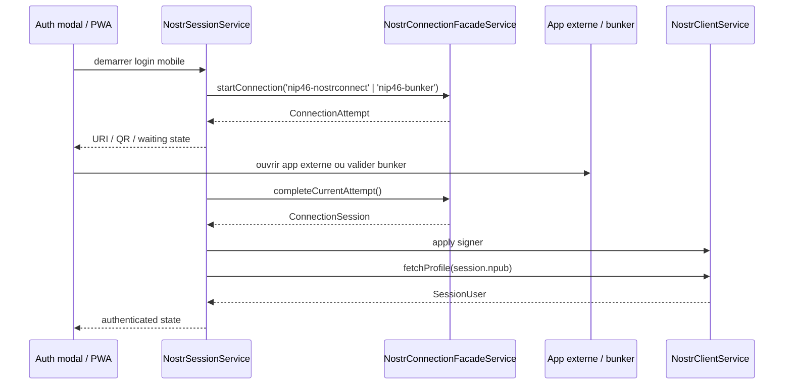
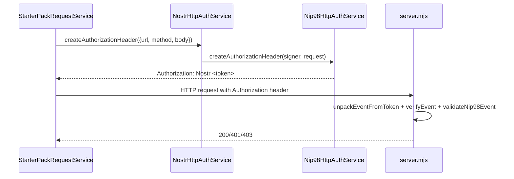

# Core Nostr

Ce dossier porte la couche Nostr utilisee par l'UI: etat de session local, client NDK, auth HTTP NIP-98 et operations metier simples (follow, DM, publication).

La session applicative est locale au frontend. Le backend reste stateless: les appels proteges sont signes requete par requete via NIP-98.

## Fichiers clefs

- [NostrSessionService](./application/nostr-session.service.ts)
- [NostrClientService](./application/nostr-client.service.ts)
- [NostrHttpAuthService](./application/nostr-http-auth.service.ts)
- [FollowService](./application/follow.service.ts)
- [Relay config](./infrastructure/relay.config.ts)
- [Auth modal component](../layout/presentation/components/app-auth-modal.component.ts)
- [Connection facade (methodes NIP-07/NIP-46)](../nostr-connection/application/connection-facade.ts)

## Workflow auth mobile PWA (signer externe / bunker)

Points importants :

- `NostrSessionService` conserve l'etat UI (`authModalOpen`, `error`, `waitingForExternalAuth`, etc.)
- la negotiation de connexion passe par le domaine `core/nostr-connection`;
- une fois connecte, le signer est applique dans `NostrClientService`;
- `bunker://` est supporte comme mode avance, sans devenir le chemin principal mobile.

## Workflow auth HTTP NIP-98 (frontend -> backend)

Implementations :

- creation token: [NostrHttpAuthService](./application/nostr-http-auth.service.ts)
- logique NIP-98 pure: [Nip98HttpAuthService](../nostr-connection/application/nip98-http-auth.service.ts)
- verification backend: [server.mjs](../../../server.mjs)

## Evenements Nostr utilises ici

- `kind 3` : follow list (contacts) via [FollowService](./application/follow.service.ts)
- `kind 4` : DM chiffree via [NostrClientService.sendDirectMessage](./application/nostr-client.service.ts)
- publication generique via [NostrClientService.publishEvent](./application/nostr-client.service.ts)

## Relays

Relays par defaut configures dans [relay.config.ts](./infrastructure/relay.config.ts).  
Ils sont injectes dans la creation NDK de [NostrClientService](./application/nostr-client.service.ts).
