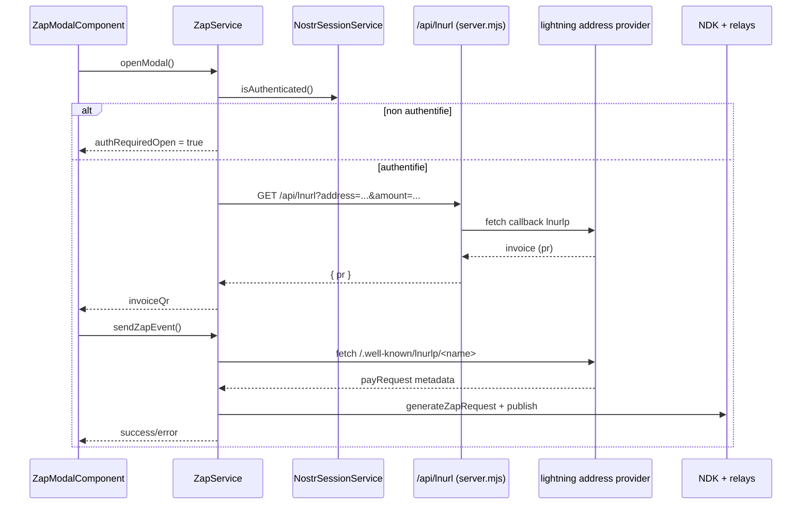

# Core Zap

Ce dossier gere l'experience zap cote application : choix montant, generation facture Lightning, puis publication du zap request event via Nostr.

## Fichiers clefs

- [ZapService](./zap.service.ts)
- [Zap modal component](./presentation/zap-modal.component.ts)
- [Project config (zapAddress, owner)](../config/project-info.ts)
- [API endpoint LNURL](../../../server.mjs)

## Workflow complet

## Notes techniques

- Le zap exige une session Nostr active (`ndk.signer` present).
- Le QR facture est un `lightning:<invoice>` genere localement.
- La publication utilise `generateZapRequest` de `@nostr-dev-kit/ndk`.
- Les relays de publication sont :
  - les relays deja connectes dans NDK, sinon
  - la liste par defaut de [relay.config.ts](../nostr/infrastructure/relay.config.ts).
