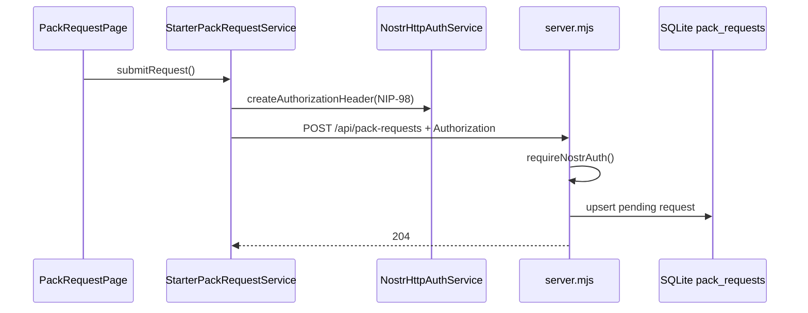
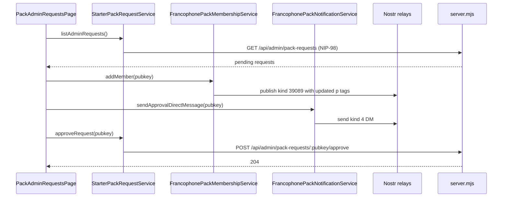

# Feature Packs

Ce dossier contient le workflow metier principal : demande d'acces au starter pack francophone, moderation admin, puis publication Nostr (pack + notification).

## Fichiers clefs

- [StarterPackRequestService](./application/starter-pack-request.service.ts)
- [FrancophonePackMembershipService](./application/francophone-pack-membership.service.ts)
- [FrancophonePackNotificationService](./application/francophone-pack-notification.service.ts)
- [Pack request page](./presentation/pages/pack-request.page.ts)
- [Admin requests page](../admin/presentation/pages/pack-admin-requests.page.ts)
- [Backend API](../../../server.mjs)

## Workflow demande utilisateur

## Workflow moderation admin

## Evenements Nostr concernes

- `kind 39089` : event pack (membres stockes dans les tags `p`)
- `kind 4` : message prive d'approbation

## Couplage important a connaitre

- Le controle admin UI repose sur `NostrSessionService.isAdmin()` (npub dans la config pack).
- Le backend revalide aussi le role admin via `ADMIN_NPUBS` dans [server.mjs](../../../server.mjs).
- L'approbation supprime la demande en base apres publication/notification.
