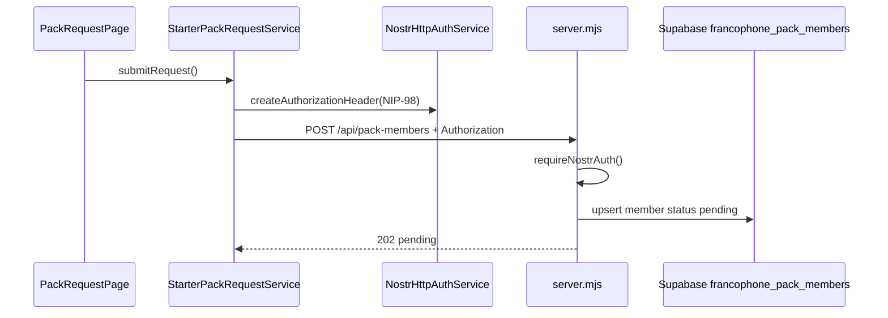
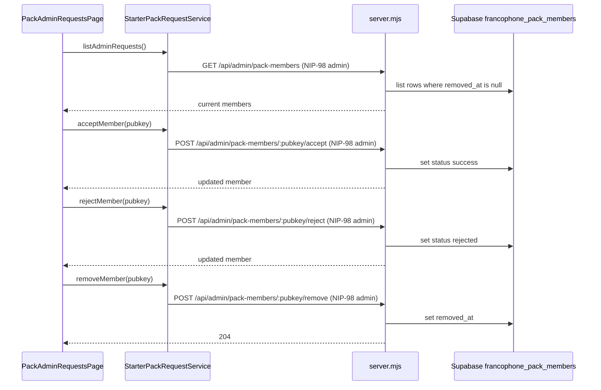

# Feature Packs

Ce dossier contient le workflow metier principal : demande d'admission au pack francophone, persistance Supabase, consultation admin et gestion des statuts.

## Fichiers clefs

- [StarterPackRequestService](./application/starter-pack-request.service.ts)
- [FrancophonePackMembershipService](./application/francophone-pack-membership.service.ts)
- [Pack request page](./presentation/pages/pack-request.page.ts)
- [Admin members page](../admin/presentation/pages/pack-admin-requests.page.ts)
- [Backend API](../../../server.mjs)

## Workflow admission utilisateur

## Workflow admin

## Stockage

Supabase est la source persistante pour les champs `pubkey`, `username`, `description`, `avatarUrl`, `status`, `joinedAt`, compteurs visibles, metadata de demande depuis l'app et `removedAt`.

## Couplage important a connaitre

- Le controle admin UI repose sur `NostrSessionService.isAdmin()` (npub dans la config pack).
- Le backend revalide aussi le role admin via `ADMIN_NPUBS` dans [server.mjs](../../../server.mjs).
- Les utilisateurs rejetes sont stockes en `status=rejected`, mais l'API user les expose comme `idle`.
- Le retrait admin conserve la ligne Supabase et renseigne `removedAt`.
